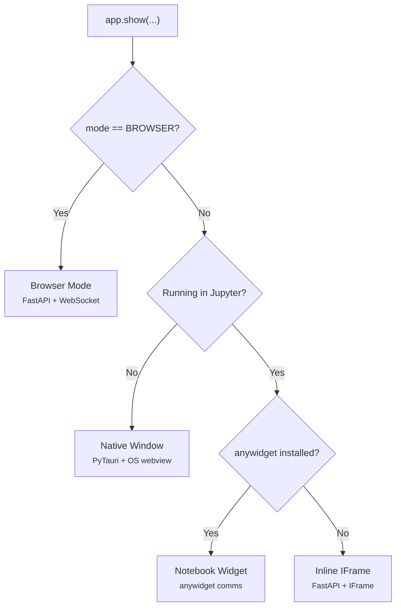

# Rendering Paths

PyWry automatically selects the best rendering path based on your environment. All paths use the same Python API — you write code once and it works everywhere.

| Environment | Path | Backend | Return Type |
|-------------|------|---------|-------------|
| Desktop/terminal with GUI | Native Window | PyTauri (Tauri/Rust) + OS webview | `NativeWindowHandle` |
| Jupyter + anywidget installed | Notebook Widget | anywidget comms | `PyWryWidget` |
| Jupyter without anywidget | Inline IFrame | FastAPI + WebSocket | `InlineWidget` |
| Headless/SSH/Server | Browser Mode | FastAPI + system browser | `InlineWidget` |

## Decision Flow



## Native Window

Uses PyTauri (which wraps Rust's Tauri framework) to create native OS windows with the platform's built-in webview — WebView2 on Windows, WebKit on macOS, and WebKit2GTK on Linux. This means a few MBs total, not the 150MB+ Electron bundles.

The native window supports full bidirectional Python-JavaScript communication, window lifecycle management, and direct access to OS-level APIs (filesystem dialogs, clipboard, notifications) via the Tauri IPC bridge.

```python
from pywry import PyWry, WindowMode

app = PyWry(
    mode=WindowMode.SINGLE_WINDOW,  # or NEW_WINDOW, MULTI_WINDOW
    theme="dark",
    width=1280,
    height=720,
)

handle = app.show("<h1 id='greeting'>Hello</h1>")
handle.emit("pywry:set-content", {"id": "greeting", "text": "Updated!"})
```

**Window Modes:**

| Mode | Behavior |
|------|----------|
| `NEW_WINDOW` | Creates a new window for each `show()` call |
| `SINGLE_WINDOW` | Reuses one window, replaces content on each `show()` |
| `MULTI_WINDOW` | Multiple named windows, update by label |

The returned `NativeWindowHandle` provides full window control — resize, maximize, minimize, set always-on-top, open DevTools, and more. See [Window Management](../guides/window-management.md).

## Notebook Widget

When running inside Jupyter, VS Code, or Colab with `anywidget` installed, PyWry renders as an anywidget-based notebook widget. This gives the tightest integration: traitlet-based bidirectional sync, no background server needed, and proper Jupyter display protocol support.

```python
from pywry import PyWry
import plotly.express as px

app = PyWry()  # Auto-detects notebook environment
fig = px.scatter(px.data.iris(), x="sepal_width", y="sepal_length")

widget = app.show_plotly(fig, callbacks={"plotly:click": handler})
widget.emit("pywry:update-theme", {"theme": "light"})
```

Requires: `pip install 'pywry[notebook]'`

## Inline IFrame

Fallback when running in a notebook but `anywidget` is not installed. PyWry starts a FastAPI server in a background thread and renders the widget inside an IFrame. Communication happens over WebSocket.

Functionally equivalent to the notebook widget — same API, same events — but uses a local HTTP server instead of anywidget's comm channel.

```python
from pywry.inline import show_plotly

widget = show_plotly(fig, callbacks={"plotly:click": handler})
```

## Browser Mode

For headless environments (servers, SSH sessions, containers, CI) where no display is available. PyWry starts a FastAPI server and opens the widget URL in the system's default browser. Use `app.block()` to keep the server running after your script completes.

```python
from pywry import PyWry, WindowMode

app = PyWry(mode=WindowMode.BROWSER)
widget = app.show("<h1>Hello</h1>")
app.block()  # Keep server running until browser tab closes
```

For production deployment with multiple users, enable [Deploy Mode](../guides/deploy-mode.md) with a Redis backend for horizontal scaling and persistent state.

## Common API

Regardless of the rendering path, all return types implement the `BaseWidget` protocol:

| Method/Property | Description |
|-----------------|-------------|
| `emit(event, data)` | Send event from Python to JavaScript |
| `on(event, callback)` | Register callback for JS-to-Python events |
| `update(html)` | Replace widget HTML content |
| `display()` | Display widget (notebooks only) |
| `label` | Unique widget/window identifier |

This means your callbacks and event handling code works identically across native windows, notebooks, and browser tabs. See the [Event System](../guides/events.md) guide for details.
