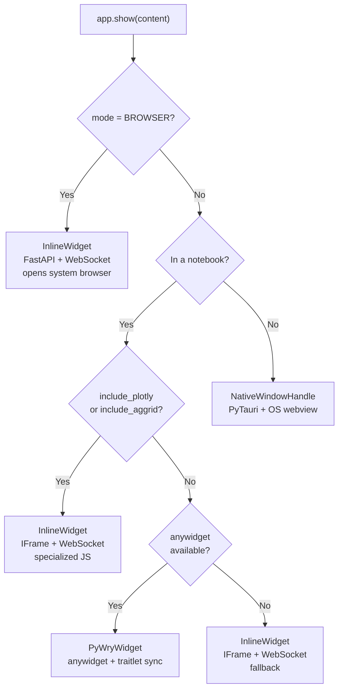

# The `app.show()` Method

`app.show()` is the primary entry point for rendering content in PyWry. It accepts HTML (as a string or `HtmlContent` object), determines the correct rendering path for the current environment, and returns a handle you can use to interact with the result.

## Basic Usage

```python
from pywry import PyWry

app = PyWry()

# Simplest form — just a string of HTML
app.show("<h1>Hello, world!</h1>")
```

This single call does everything: it detects whether you're in a terminal, a Jupyter notebook, or browser mode — then opens a native window, renders an anywidget, or starts a server accordingly.

## Signature

```python
app.show(
    content,                    # str | HtmlContent — the HTML to render
    title=None,                 # str — window title (native mode)
    width=None,                 # int | str — width in pixels (int) or CSS value (str, e.g. "60%")
    height=None,                # int — height in pixels
    callbacks=None,             # dict[str, Callable] — event handlers
    include_plotly=False,       # bool — load the Plotly.js library
    include_aggrid=False,       # bool — load the AG Grid library
    aggrid_theme="alpine",      # str — AG Grid theme name
    label=None,                 # str — window label for multi-window targeting
    watch=None,                 # bool — enable hot reload for CSS/JS files
    toolbars=None,              # list[Toolbar | dict] — toolbar configurations
    modals=None,                # list[Modal | dict] — modal dialog configurations
)
```

## Parameters in Detail

### `content` — what to render

Accepts either a plain HTML string or an `HtmlContent` object. When you pass a string, PyWry wraps it in a minimal document structure automatically. When you pass `HtmlContent`, you get control over CSS files, JS files, inline styles, JSON data injection, and hot reload watching. See the [HtmlContent guide](html-content.md) for details.

```python
# Plain string — PyWry wraps it in a full HTML document
app.show("<div id='app'>Hello</div>")

# HtmlContent — full control over assets
from pywry import HtmlContent

content = HtmlContent(
    html="<div id='app'>Hello</div>",
    css_files=["styles/app.css"],
    script_files=["scripts/app.js"],
    inline_css="body { background: #1a1a2e; color: white; }",
    json_data={"items": [1, 2, 3]},
    watch=True,
)
app.show(content)
```

### `title` — window title

Sets the title bar text in native window mode. Defaults to `"PyWry"`. Ignored in notebook and browser modes.

```python
app.show("<h1>Dashboard</h1>", title="Sales Dashboard")
```

### `width` and `height` — dimensions

In native mode, `width` accepts an integer (pixels) for the OS window size. In notebook mode, `width` can also be a CSS string like `"100%"` or `"500px"`. `height` is always an integer (pixels).

```python
# Native window: 800×600 pixels
app.show(html, width=800, height=600)

# Notebook: full-width, 400px tall
app.show(html, width="100%", height=400)
```

Defaults come from `WindowConfig` — 1280×720 unless overridden in your configuration.

### `callbacks` — event handlers

A dictionary mapping event names to Python callback functions. These are registered before the content is rendered, so they're ready to receive events immediately.

```python
def on_click(data, event_type, label):
    print(f"Clicked: {data}")

def on_save(data, event_type, label):
    print("Saving...")

app.show(html, callbacks={
    "plotly:click": on_click,
    "app:save": on_save,
})
```

See the [Event System guide](events.md) for the full callback signature and registration patterns.

### `include_plotly` and `include_aggrid` — library loading

When `True`, PyWry injects the Plotly.js or AG Grid JavaScript and CSS libraries into the page. You don't need to set these manually if you use `app.show_plotly()` or `app.show_dataframe()` — they set the flags automatically.

```python
# Manual: include Plotly when using raw HTML with Plotly
app.show(plotly_html, include_plotly=True)

# Automatic: show_plotly() handles this for you
app.show_plotly(fig)
```

### `label` — window identity

In `MULTI_WINDOW` mode, the `label` identifies which window to create or update. In `SINGLE_WINDOW` mode, the label is fixed and this parameter is ignored. Labels are used in callbacks to target events back to a specific window.

```python
from pywry import PyWry, WindowMode

app = PyWry(mode=WindowMode.MULTI_WINDOW)
app.show(chart_html, label="chart")
app.show(table_html, label="table")

# Later, inside a callback:
def on_filter(data, event_type, label):
    app.emit("app:update", {"filter": data}, "chart")  # target the chart window
```

### `watch` — hot reload

When `True`, PyWry watches the CSS and JS files referenced by `HtmlContent.css_files` and `HtmlContent.script_files` for changes, and live-reloads them in the browser without a full page refresh.

```python
content = HtmlContent(
    html="<div>Dashboard</div>",
    css_files=["styles/dashboard.css"],
    watch=True,  # or set it here
)
app.show(content, watch=True)  # or override here
```

See the [Hot Reload guide](hot-reload.md) for details.

### `toolbars` and `modals` — UI chrome

Lists of `Toolbar` or `Modal` objects (or their dict equivalents) that wrap your content in an interactive layout. Toolbars are positioned around the content area; modals are hidden until triggered by events.

```python
from pywry import Toolbar, Button, TextInput, Modal

toolbar = Toolbar(position="top", items=[
    Button(label="Save", event="app:save"),
    TextInput(label="Search", event="app:search"),
])

modal = Modal(id="settings", title="Settings", items=[
    TextInput(label="Name", event="settings:name"),
    Button(label="Apply", event="settings:apply"),
])

app.show(html, toolbars=[toolbar], modals=[modal])
```

See the [Toolbar System guide](toolbars.md) for the full component list and layout positions.

## Return Value

`app.show()` returns a handle that provides a consistent API regardless of rendering path:

```python
handle = app.show(html)

# Send events to this specific window/widget
handle.emit("pywry:set-content", {"selector": "h1", "text": "Updated"})

# Register additional callbacks
handle.on("app:click", on_click)
```

The returned type depends on the environment:

| Environment | Return Type | Transport |
|---|---|---|
| Desktop terminal | `NativeWindowHandle` | stdin pipe → Tauri IPC |
| Jupyter (with anywidget) | `PyWryWidget` | traitlet sync |
| Jupyter (IFrame fallback) | `InlineWidget` | WebSocket |
| Browser mode | `InlineWidget` | WebSocket |

All implement the `BaseWidget` protocol, so `emit()` and `on()` work identically.

## Convenience Methods

`app.show()` is the general-purpose method. PyWry also provides specialized variants that configure the right options automatically:

### `app.show_plotly(figure, ...)`

Converts a Plotly figure to HTML, injects Plotly.js, and pre-wires chart events (`plotly:click`, `plotly:hover`, `plotly:selected`, `plotly:relayout`).

```python
import plotly.express as px

fig = px.scatter(x=[1, 2, 3], y=[1, 4, 9])
app.show_plotly(fig, callbacks={"plotly:click": on_click})
```

### `app.show_dataframe(data, ...)`

Converts a DataFrame to AG Grid HTML, injects the AG Grid library, and pre-wires grid events (`grid:cell-clicked`, `grid:selection-changed`, `grid:cell-edited`).

```python
import pandas as pd

df = pd.DataFrame({"Name": ["Alice", "Bob"], "Score": [95, 87]})
app.show_dataframe(df, callbacks={"grid:cell-clicked": on_cell})
```

Both methods accept all the same optional parameters as `app.show()` (`title`, `width`, `height`, `callbacks`, `label`, `toolbars`, `modals`).

## Rendering Path Selection

`app.show()` detects the environment and selects the rendering path automatically:



You can force a specific mode by setting it on the app:

```python
from pywry import PyWry, WindowMode

# Always use native windows (even in notebooks)
app = PyWry(mode=WindowMode.SINGLE_WINDOW)

# Always use browser
app = PyWry(mode=WindowMode.BROWSER)
```

## Next Steps

- **[HtmlContent](html-content.md)** — Control CSS, JS, and data injection
- **[Content Assembly](content-assembly.md)** — How PyWry builds the final HTML document
- **[Event System](events.md)** — Two-way Python ↔ JavaScript communication
- **[Toolbar System](toolbars.md)** — Building interactive controls
