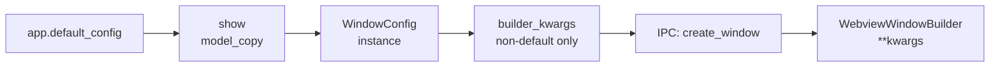

# Builder Options & Initialization Scripts

PyWry's `WindowConfig` controls **builder-level** settings that are applied when the native window is first created. These settings are passed to `WebviewWindowBuilder` in the pytauri subprocess.

## Builder Fields

These fields map 1:1 to Tauri's `WebviewWindowBuilder`:

| Field | Type | Default | Description |
|:---|:---|:---|:---|
| `resizable` | `bool` | `True` | User can resize the window |
| `decorations` | `bool` | `True` | Show title bar and borders |
| `always_on_top` | `bool` | `False` | Window stays above all others |
| `always_on_bottom` | `bool` | `False` | Window stays below all others |
| `transparent` | `bool` | `False` | Enable window transparency |
| `fullscreen` | `bool` | `False` | Open in fullscreen mode |
| `maximized` | `bool` | `False` | Open maximized |
| `focused` | `bool` | `True` | Focus window on creation |
| `visible` | `bool` | `True` | Show window immediately |
| `shadow` | `bool` | `True` | Window has a drop shadow |
| `skip_taskbar` | `bool` | `False` | Hide from taskbar/dock |
| `content_protected` | `bool` | `False` | Prevent screenshots |
| `user_agent` | `str` &#124; `None` | `None` | Custom User-Agent string |
| `incognito` | `bool` | `False` | Incognito/private mode |
| `initialization_script` | `str` &#124; `None` | `None` | JS injected before page load |
| `drag_and_drop` | `bool` | `True` | Enable native drag & drop |

## Setting Builder Defaults

### At Construction

```python
from pywry import PyWry, WindowConfig

config = WindowConfig(
    transparent=True,
    decorations=False,
    always_on_top=True,
)
app = PyWry(default_config=config)
```

### After Construction

Modify the default config directly via the `default_config` property:

```python
app = PyWry()
app.default_config.resizable = False
app.default_config.user_agent = "MyApp/1.0"
```

### Per-Window Override

Builder fields on the default config flow to every `show()` call automatically. Non-default values are forwarded as `**kwargs` to `WebviewWindowBuilder`:

```python
# All windows get the defaults...
app.show("<h1>Default Settings</h1>")

# ...unless overridden via WindowConfig
from pywry import WindowConfig
custom = app.default_config.model_copy(update={"transparent": False})
# (Pass custom config via content objects or direct config parameter)
```

## How Fields Flow



Only fields that differ from their defaults are sent over IPC. For a fresh `WindowConfig()`, `builder_kwargs()` returns an empty dict.

---

## Initialization Scripts

An initialization script is JavaScript that runs **before** the page loads and **persists across navigations**. It's injected by `WebviewWindowBuilder.initialization_script()` in the Tauri subprocess.

Common uses:

- Polyfills or shims
- Global configuration objects
- Analytics or telemetry setup
- Custom `window.pywry` extensions

### Setting a Default Script

All new windows will have this script:

```python
app = PyWry()
app.set_initialization_script("""
    window.__APP_CONFIG__ = {
        version: "1.0",
        debug: true,
    };
    console.log("Init script loaded");
""")

# Every show() call now includes this script
app.show("<h1>Has init script</h1>")
```

### Per-Window Script

Override or extend the default on individual `show()` calls:

```python
app.show(
    "<h1>Custom Init</h1>",
    initialization_script="""
        window.__CUSTOM__ = true;
        console.log("Per-window init");
    """,
)
```

### Via default_config

You can also set it directly on the config:

```python
app.default_config.initialization_script = "console.log('hello')"
```

### Auto-Promotion

When `initialization_script` is set on `HtmlContent`, it's automatically promoted to the `WindowConfig.initialization_script` builder field:

```python
from pywry import HtmlContent

content = HtmlContent(
    body="<h1>Content</h1>",
    initialization_script="window.__preload = true;",
)
# The script is auto-promoted to builder-level
```

!!! warning "Builder-level only"
    Initialization scripts are set at window **creation** time. They cannot be changed after the window is created. To run JavaScript dynamically, use `handle.eval()` instead.

---

## WindowConfig.builder_kwargs()

The `builder_kwargs()` method returns a dict of only the non-default builder fields, ready to be unpacked as `**kwargs`:

```python
from pywry.models import WindowConfig

config = WindowConfig(transparent=True, user_agent="test/1.0")
print(config.builder_kwargs())
# {'transparent': True, 'user_agent': 'test/1.0'}

config2 = WindowConfig()  # all defaults
print(config2.builder_kwargs())
# {}
```

This is used internally by the runtime to avoid sending unnecessary data over IPC.
