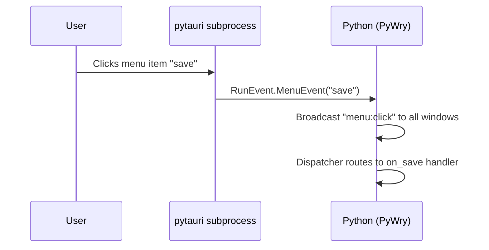

# Native Menus

PyWry exposes the full Tauri menu system — menu bars, submenus, check items, icons, keyboard accelerators, and context (right-click) menus — through a Python-first API that communicates over IPC with the native subprocess.

**Every clickable menu item must have a handler.** You define the handler when you create the item — there is no separate "register later" step.

## Architecture

Menus are managed through two layers:

| Layer | Class | Purpose |
|:---|:---|:---|
| **MenuProxy** | `pywry.menu_proxy.MenuProxy` | Create, mutate, and attach menus |
| **WindowProxy** | `pywry.window_proxy.WindowProxy` | Per-window menu attachment and visibility |

`MenuProxy` sends IPC commands to the pytauri subprocess which calls the real Tauri `Menu`, `MenuItem`, `Submenu`, etc. APIs.  The proxy pattern means your Python code never blocks on native rendering.

---

## Quick Start

```python
from pywry import (
    PyWry,
    MenuConfig,
    MenuItemConfig,
    CheckMenuItemConfig,
    SubmenuConfig,
    PredefinedMenuItemConfig,
    PredefinedMenuItemKind,
)

app = PyWry()


# ── Define handlers FIRST ────────────────────────────────────────
def on_new(data, event_type, label):
    print("Creating new file…")


def on_open(data, event_type, label):
    print("Opening file…")


def on_quit(data, event_type, label):
    app.destroy()


# ── Build menu items — every item gets its handler inline ────────
file_menu = SubmenuConfig(
    id="file",
    text="File",
    items=[
        MenuItemConfig(id="new", text="New", handler=on_new, accelerator="CmdOrCtrl+N"),
        MenuItemConfig(id="open", text="Open", handler=on_open, accelerator="CmdOrCtrl+O"),
        PredefinedMenuItemConfig(kind_name=PredefinedMenuItemKind.SEPARATOR),
        MenuItemConfig(id="quit", text="Quit", handler=on_quit, accelerator="CmdOrCtrl+Q"),
    ],
)

edit_menu = SubmenuConfig(
    id="edit",
    text="Edit",
    items=[
        PredefinedMenuItemConfig(kind_name=PredefinedMenuItemKind.CUT),
        PredefinedMenuItemConfig(kind_name=PredefinedMenuItemKind.COPY),
        PredefinedMenuItemConfig(kind_name=PredefinedMenuItemKind.PASTE),
    ],
)

menu = MenuConfig(id="main-menu", items=[file_menu, edit_menu])

# ── Show with menu — handlers are wired BEFORE the window appears
handle = app.show("<h1>Hello Menu!</h1>", menu=menu)
```

!!! important
    Pass `menu=` to `app.show()`. This creates the native menu **and** registers all item handlers on the window before it becomes visible. You never need a separate `handle.on("menu:click", ...)` step.

---

## Menu Item Types

### MenuItemConfig

A normal clickable menu item. **`handler` is required.**

```python
from pywry import MenuItemConfig

def on_save(data, event_type, label):
    print("Saving…")

item = MenuItemConfig(
    id="save",                   # Unique ID — sent in menu:click events
    text="Save",                 # Display text
    handler=on_save,             # REQUIRED — click handler
    enabled=True,                # Default True; set False to grey out
    accelerator="CmdOrCtrl+S",  # Keyboard shortcut (optional)
)
```

| Field | Type | Default | Description |
|:---|:---|:---|:---|
| `id` | `str` | *required* | Unique ID used in event routing |
| `text` | `str` | *required* | Display text |
| `handler` | `Callable` | *required* | Click handler `(data, event_type, label)` |
| `enabled` | `bool` | `True` | Whether the item is clickable |
| `accelerator` | `str` &#124; `None` | `None` | Keyboard shortcut string |

!!! failure "TypeError if handler is missing"
    ```python
    MenuItemConfig(id="save", text="Save")  # raises TypeError
    ```

### CheckMenuItemConfig

A toggle item with a check mark. **`handler` is required.**

```python
from pywry import CheckMenuItemConfig

def on_bold(data, event_type, label):
    print("Bold toggled")

item = CheckMenuItemConfig(
    id="bold",
    text="Bold",
    handler=on_bold,
    checked=True,
    accelerator="CmdOrCtrl+B",
)
```

| Field | Type | Default | Description |
|:---|:---|:---|:---|
| `id` | `str` | *required* | Unique ID |
| `text` | `str` | *required* | Display text |
| `handler` | `Callable` | *required* | Click handler |
| `enabled` | `bool` | `True` | Whether the item is interactive |
| `checked` | `bool` | `False` | Initial checked state |
| `accelerator` | `str` &#124; `None` | `None` | Keyboard shortcut |

### IconMenuItemConfig

A menu item with an icon (RGBA bytes or native OS icon). **`handler` is required.**

```python
from pywry import IconMenuItemConfig

def on_doc(data, event_type, label):
    print("Document clicked")

# With RGBA bytes
item = IconMenuItemConfig(
    id="doc",
    text="Document",
    handler=on_doc,
    icon=rgba_bytes,
    icon_width=16,
    icon_height=16,
)

# With native icon (macOS)
item = IconMenuItemConfig(
    id="folder",
    text="Open Folder",
    handler=on_doc,
    native_icon="Folder",
)
```

| Field | Type | Default | Description |
|:---|:---|:---|:---|
| `id` | `str` | *required* | Unique ID |
| `text` | `str` | *required* | Display text |
| `handler` | `Callable` | *required* | Click handler |
| `enabled` | `bool` | `True` | Whether the item is clickable |
| `icon` | `bytes` &#124; `None` | `None` | RGBA icon bytes |
| `icon_width` | `int` | `16` | Icon width in pixels |
| `icon_height` | `int` | `16` | Icon height in pixels |
| `native_icon` | `str` &#124; `None` | `None` | Native OS icon name |
| `accelerator` | `str` &#124; `None` | `None` | Keyboard shortcut |

### PredefinedMenuItemConfig

OS-standard items like Cut, Copy, Paste, Separator, About, etc. These do **not** need a handler — the OS handles them natively.

```python
from pywry import PredefinedMenuItemConfig, PredefinedMenuItemKind

separator = PredefinedMenuItemConfig(kind_name=PredefinedMenuItemKind.SEPARATOR)
about = PredefinedMenuItemConfig(kind_name=PredefinedMenuItemKind.ABOUT, text="About MyApp")
```

Available kinds:

| Kind | Description |
|:---|:---|
| `SEPARATOR` | Visual divider line |
| `COPY` | OS copy action |
| `CUT` | OS cut action |
| `PASTE` | OS paste action |
| `SELECT_ALL` | Select all |
| `UNDO` | Undo action |
| `REDO` | Redo action |
| `MINIMIZE` | Minimize window |
| `MAXIMIZE` | Maximize window |
| `FULLSCREEN` | Toggle fullscreen |
| `HIDE` | Hide application |
| `HIDE_OTHERS` | Hide other applications |
| `SHOW_ALL` | Show all windows |
| `CLOSE_WINDOW` | Close current window |
| `QUIT` | Quit application |
| `ABOUT` | Show about dialog |
| `SERVICES` | macOS services menu |

### SubmenuConfig

A nested container that holds other menu items.

```python
from pywry import SubmenuConfig, MenuItemConfig

def on_zoom_in(data, event_type, label):
    print("Zoom in")

def on_zoom_out(data, event_type, label):
    print("Zoom out")

view_menu = SubmenuConfig(
    id="view",
    text="View",
    items=[
        MenuItemConfig(id="zoom-in", text="Zoom In", handler=on_zoom_in, accelerator="CmdOrCtrl+Plus"),
        MenuItemConfig(id="zoom-out", text="Zoom Out", handler=on_zoom_out, accelerator="CmdOrCtrl+Minus"),
    ],
)
```

Submenus can be nested arbitrarily deep.

---

## Creating Menus

### Via app.show(menu=...)

**The recommended approach.** Define a `MenuConfig` with handler-bearing items and pass it directly to `show()`. Handlers are wired up *before* the window appears:

```python
menu = MenuConfig(id="main-menu", items=[file_menu, edit_menu, view_menu])
handle = app.show("<h1>Content</h1>", menu=menu)
```

### Via MenuProxy.create()

If you need the proxy object for later mutation:

```python
from pywry import MenuProxy

proxy = MenuProxy.create(menu_id="main-menu", items=[file_menu, edit_menu])
# Handlers are extracted automatically and stored on the proxy.
# To register them on a window:
proxy.register_handlers("main")
proxy.set_as_window_menu("main")
```

### Via MenuConfig + MenuProxy.from_config()

Use `MenuConfig` when you want to serialize/deserialize the full menu structure:

```python
from pywry import MenuConfig

config = MenuConfig(id="main-menu", items=[file_menu, edit_menu])

# Serialize to dict (e.g. for JSON storage)
d = config.to_dict()

# Restore from dict — items get a no-op handler placeholder
config2 = MenuConfig.from_dict(d)

# Create proxy from config
proxy = MenuProxy.from_config(config2)
```

!!! warning "Deserialized items have placeholder handlers"
    Items created via `MenuConfig.from_dict()` have a no-op handler. Replace it with a real handler before attaching to a window.

---

## Mutating Menus

All mutations happen live — the native menu updates immediately.

```python
def on_export(data, event_type, label):
    print("Exporting…")

def on_import(data, event_type, label):
    print("Importing…")

def on_save_as(data, event_type, label):
    print("Save as…")

# Add items (handler required on new items)
menu.append(MenuItemConfig(id="export", text="Export", handler=on_export))
menu.prepend(MenuItemConfig(id="import", text="Import", handler=on_import))
menu.insert(MenuItemConfig(id="save-as", text="Save As…", handler=on_save_as), position=2)

# Remove items
menu.remove("export")

# Update item properties
menu.set_text("save", "Save All")
menu.set_enabled("save", False)
menu.set_checked("bold", True)
menu.set_accelerator("save", "CmdOrCtrl+Shift+S")
menu.set_icon("doc", icon_bytes, width=16, height=16)
```

---

## Context (Right-Click) Menus

Show a menu as a popup at the cursor position or at specific coordinates:

```python
# At cursor position
handle.popup_menu(menu)

# At specific coordinates (logical pixels)
handle.popup_menu(menu, x=100.0, y=200.0)

# Or via the proxy directly
menu.popup("main", x=100.0, y=200.0)
```

---

## Menu Visibility

Toggle the menu bar without removing it:

```python
handle.hide_menu()
handle.show_menu()

if handle.is_menu_visible():
    handle.hide_menu()
```

To fully detach:

```python
handle.remove_menu()
```

---

## Collecting Handlers

`MenuConfig.collect_handlers()` walks the entire item tree (including nested submenus) and returns a flat `{item_id: handler}` dict. This is used internally by `app.show(menu=...)` and `MenuProxy.register_handlers()`:

```python
menu = MenuConfig(
    id="m",
    items=[
        SubmenuConfig(id="file", text="File", items=[
            MenuItemConfig(id="new", text="New", handler=on_new),
            MenuItemConfig(id="quit", text="Quit", handler=on_quit),
        ]),
    ],
)

handlers = menu.collect_handlers()
# {"new": on_new, "quit": on_quit}
```

---

## Event Flow

When a user clicks a menu item the event flows through the `menu:click` event namespace. Because handlers are registered per-item during `show()`, they are called automatically — no manual `handle.on("menu:click", ...)` needed.



---

## Destroying Menus

```python
menu.destroy()  # Removes from subprocess, frees resources
```

!!! warning
    After calling `destroy()`, the proxy is no longer usable. Any calls to mutation or attachment methods will fail.

---

## Complete Example

```python
from pywry import (
    PyWry,
    MenuConfig,
    MenuItemConfig,
    CheckMenuItemConfig,
    SubmenuConfig,
    PredefinedMenuItemConfig,
    PredefinedMenuItemKind,
)

app = PyWry()


# ── Handlers ──────────────────────────────────────────────────────
def on_new(data, event_type, label):
    print("Creating new file…")


def on_open(data, event_type, label):
    print("Opening file…")


def on_save(data, event_type, label):
    print("Saving…")


def on_quit(data, event_type, label):
    app.destroy()


def on_sidebar(data, event_type, label):
    print("Sidebar toggled")


def on_statusbar(data, event_type, label):
    print("Status bar toggled")


def on_zoom_in(data, event_type, label):
    print("Zoom in")


def on_zoom_out(data, event_type, label):
    print("Zoom out")


def on_zoom_reset(data, event_type, label):
    print("Zoom reset")


# ── Menu structure ────────────────────────────────────────────────
menu = MenuConfig(
    id="app-menu",
    items=[
        SubmenuConfig(id="file", text="File", items=[
            MenuItemConfig(id="new", text="New File", handler=on_new, accelerator="CmdOrCtrl+N"),
            MenuItemConfig(id="open", text="Open…", handler=on_open, accelerator="CmdOrCtrl+O"),
            MenuItemConfig(id="save", text="Save", handler=on_save, accelerator="CmdOrCtrl+S"),
            PredefinedMenuItemConfig(kind_name=PredefinedMenuItemKind.SEPARATOR),
            MenuItemConfig(id="quit", text="Quit", handler=on_quit, accelerator="CmdOrCtrl+Q"),
        ]),
        SubmenuConfig(id="edit", text="Edit", items=[
            PredefinedMenuItemConfig(kind_name=PredefinedMenuItemKind.UNDO),
            PredefinedMenuItemConfig(kind_name=PredefinedMenuItemKind.REDO),
            PredefinedMenuItemConfig(kind_name=PredefinedMenuItemKind.SEPARATOR),
            PredefinedMenuItemConfig(kind_name=PredefinedMenuItemKind.CUT),
            PredefinedMenuItemConfig(kind_name=PredefinedMenuItemKind.COPY),
            PredefinedMenuItemConfig(kind_name=PredefinedMenuItemKind.PASTE),
        ]),
        SubmenuConfig(id="view", text="View", items=[
            CheckMenuItemConfig(id="sidebar", text="Show Sidebar", handler=on_sidebar, checked=True),
            CheckMenuItemConfig(id="statusbar", text="Show Status Bar", handler=on_statusbar, checked=True),
            PredefinedMenuItemConfig(kind_name=PredefinedMenuItemKind.SEPARATOR),
            MenuItemConfig(id="zoom-in", text="Zoom In", handler=on_zoom_in, accelerator="CmdOrCtrl+Plus"),
            MenuItemConfig(id="zoom-out", text="Zoom Out", handler=on_zoom_out, accelerator="CmdOrCtrl+Minus"),
            MenuItemConfig(id="zoom-reset", text="Reset Zoom", handler=on_zoom_reset, accelerator="CmdOrCtrl+0"),
        ]),
    ],
)

# ── Show — menu is fully wired before the window appears ─────────
handle = app.show(
    "<h1>My Application</h1><p>Full menu bar example.</p>",
    title="Menu Demo",
    menu=menu,
)
```
