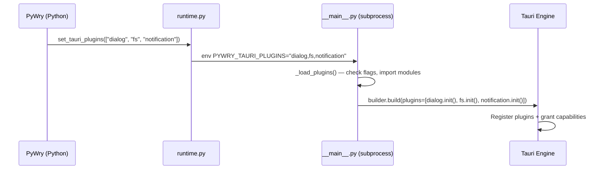

# Tauri Plugins

PyWry's native window mode runs on [Tauri](https://tauri.app) via the [PyTauri](https://pytauri.github.io/pytauri/) Python bindings. Tauri ships a rich ecosystem of **plugins** — clipboard access, notifications, HTTP requests, filesystem operations, global shortcuts, and more. PyWry exposes a configuration-driven system for enabling any of the 19 bundled plugins.

## How It Works



1. You list the plugins you want in config (Python, TOML, or env var).
2. `PyWry.__init__()` forwards them to the runtime module.
3. The runtime passes `PYWRY_TAURI_PLUGINS` as an environment variable to the subprocess.
4. The subprocess dynamically imports and initialises only the requested plugins.
5. Tauri's capability system (via `capabilities/default.toml`) pre-grants `:default` permissions for all bundled plugins, so capabilities don't need separate configuration.

---

## Quick Start

### Python

```python
from pywry import PyWry, PyWrySettings

settings = PyWrySettings(
    tauri_plugins=["dialog", "fs", "notification", "clipboard_manager"],
)

app = PyWry(settings=settings)
app.show("<h1>Hello with plugins!</h1>")
```

### pywry.toml

```toml
tauri_plugins = ["dialog", "fs", "notification", "clipboard_manager"]
```

### pyproject.toml

```toml
[tool.pywry]
tauri_plugins = ["dialog", "fs", "notification", "clipboard_manager"]
```

### Environment Variable

```bash
# Comma-separated plugin names
export PYWRY_TAURI_PLUGINS="dialog,fs,notification,clipboard_manager"
```

```powershell
# PowerShell
$env:PYWRY_TAURI_PLUGINS = "dialog,fs,notification,clipboard_manager"
```

!!! info "Defaults"
    If you don't configure anything, `dialog` and `fs` are enabled — matching PyWry's original behaviour.

---

## Available Plugins

All 19 plugins bundled in the `pytauri_wheel` binary are listed below. Each plugin exposes a JavaScript (`window.__TAURI__.*`) and/or Python API once enabled.

| Plugin name | JS API | Description |
|:---|:---|:---|
| `autostart` | — | Launch at OS login |
| `clipboard_manager` | `clipboard` | Read/write system clipboard |
| `deep_link` | `deepLink` | Handle custom URL schemes |
| `dialog` | `dialog` | Native open/save/message dialogs |
| `fs` | `fs` | Filesystem read/write/watch |
| `global_shortcut` | `globalShortcut` | System-wide keyboard shortcuts |
| `http` | `http` | HTTP client (fetch replacement) |
| `notification` | `notification` | OS notification centre |
| `opener` | `opener` | Open URLs / files with default app |
| `os` | `os` | Platform, arch, locale info |
| `persisted_scope` | — | Persist runtime FS scopes across restarts |
| `positioner` | — | Position windows (centre, tray, etc.) |
| `process` | `process` | Restart / exit app |
| `shell` | `shell` | Execute system commands |
| `single_instance` | — | Prevent duplicate app instances |
| `updater` | `updater` | Auto-update from remote server |
| `upload` | `upload` | Upload files with progress |
| `websocket` | `websocket` | WebSocket client |
| `window_state` | — | Save/restore window size & position |

!!! note "Feature flags"
    Each plugin has a compile-time feature flag (e.g. `PLUGIN_NOTIFICATION`). If the bundled `pytauri_wheel` was not compiled with a particular feature, enabling that plugin at runtime will raise a `RuntimeError` with a clear message. The default PyWry wheel includes all 19.

---

## Using Plugin APIs in JavaScript

Once a plugin is enabled, its JavaScript API is available through the Tauri bridge. Use the [JavaScript Bridge](javascript-bridge.md) to interact:

```python
app = PyWry(settings=PyWrySettings(
    tauri_plugins=["dialog", "fs", "notification", "clipboard_manager"],
))

html = """
<button onclick="showNotification()">Notify</button>
<script>
async function showNotification() {
    // Tauri notification plugin API
    const { sendNotification } = window.__TAURI__.notification;
    sendNotification({
        title: "PyWry",
        body: "Hello from a Tauri plugin!",
    });
}
</script>
"""
app.show(html)
```

!!! tip "Plugin documentation"
    For the full JavaScript API of each plugin, see the [Tauri Plugins documentation](https://tauri.app/plugin/).

---

## Extra Capabilities

Tauri's [capability system](https://tauri.app/security/capabilities/) controls which APIs a window is allowed to call. By default, PyWry grants `:default` permissions for every bundled plugin. This is sufficient for most use cases.

If you need **fine-grained permissions** beyond the defaults (e.g. `shell:allow-execute`, `fs:allow-read-file`), use the `extra_capabilities` setting:

```python
settings = PyWrySettings(
    tauri_plugins=["shell", "fs"],
    extra_capabilities=["shell:allow-execute", "fs:allow-read-file"],
)
```

Or via TOML:

```toml
tauri_plugins = ["shell", "fs"]
extra_capabilities = ["shell:allow-execute", "fs:allow-read-file"]
```

Or the environment variable:

```bash
export PYWRY_EXTRA_CAPABILITIES="shell:allow-execute,fs:allow-read-file"
```

!!! warning "Capability names use hyphens"
    Tauri permission strings use **hyphens**, not underscores: `clipboard-manager:default`, not `clipboard_manager:default`. Plugin *config names* use underscores (Python identifiers), but capability *permission strings* use the Tauri convention.

---

## Capabilities That Don't Exist

Two plugins — `persisted_scope` and `single_instance` — do **not** register Tauri capability manifests. They are Rust-only plugins without permission-gated functionality. Including `persisted-scope:default` or `single-instance:default` in a capabilities file will cause a **Tauri panic** at startup. PyWry's `capabilities/default.toml` intentionally omits them.

You can still _enable_ these plugins (they'll be initialised at the Rust level), but do not add capability strings for them.

---

## Architecture Details

### Plugin loading flow

1. **`config.py`** — `PyWrySettings.tauri_plugins` validates names against `AVAILABLE_TAURI_PLUGINS`.
2. **`app.py`** — `PyWry.__init__()` calls `runtime.set_tauri_plugins(settings.tauri_plugins)` and `runtime.set_extra_capabilities(settings.extra_capabilities)`.
3. **`runtime.py`** — Stores both lists and passes them as `PYWRY_TAURI_PLUGINS` and `PYWRY_EXTRA_CAPABILITIES` environment variables when starting the subprocess.
4. **`__main__.py`** — The subprocess:
    - Reads `PYWRY_TAURI_PLUGINS`, calls `_load_plugins()` which validates names, checks `PLUGIN_*` feature flags, dynamically imports modules, and calls `.init()`.
    - Reads `PYWRY_EXTRA_CAPABILITIES`. If non-empty, copies the package directory to a temp staging dir and writes an `extra.toml` capability file with the requested permissions. This is necessary because `context_factory()` reads capabilities from static TOML files, and installed packages may be read-only.
5. **Tauri build** — `context_factory(ctx_dir)` reads all `.toml` files under `capabilities/` (including the staged `extra.toml` if present), then `builder_factory().build(plugins=plugins)` registers all initialised plugins with the Tauri engine.

### Capability files

Base permissions live in [`pywry/capabilities/default.toml`](https://github.com/deeleeramone/PyWry/blob/main/pywry/pywry/capabilities/default.toml). It pre-grants `:default` for all 17 plugins that have valid Tauri capability manifests. Permissions for plugins that aren't initialised are simply unused — they don't cause errors or security issues.

When `extra_capabilities` is configured, an additional `extra.toml` is generated at runtime in a temporary directory with just the extra permissions. The temp directory is cleaned up when the subprocess exits.

---

## Troubleshooting

### "Unknown Tauri plugin 'xyz'"

The plugin name isn't in the registry. Check spelling — use underscores (e.g. `clipboard_manager`, not `clipboard-manager`).

### "PLUGIN_XYZ feature was not compiled"

The `pytauri_wheel` binary was compiled without that plugin's feature flag. This shouldn't happen with the default PyWry distribution, but custom builds may exclude plugins.

### App crashes on startup after adding capabilities

If you get a `PanicException` mentioning `UnknownManifest`, you've added a capability string for a plugin that doesn't register one (`persisted_scope` or `single_instance`). Remove the offending string from `extra_capabilities`.

---

## Next Steps

- **[Configuration Guide](configuration.md)** — Full settings reference
- **[JavaScript Bridge](javascript-bridge.md)** — Calling Tauri APIs from JS
- **[Events](events.md)** — Python↔JS event system
- **[PyTauri Plugin Docs](https://pytauri.github.io/pytauri/latest/usage/tutorial/using-plugins/)** — Upstream plugin tutorial
