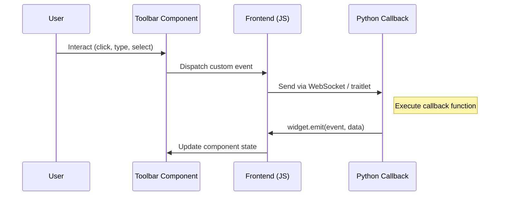

# Toolbar System

PyWry provides 18 declarative Pydantic components for building interactive toolbars — no HTML or JavaScript required. This guide walks through how to create toolbars, handle events, and manage component state programmatically.

For individual component APIs, see the [Components](../components/index.md) section. For event payloads, see the [Event Reference](../reference/events.md#component-event-payloads).

## Creating a Toolbar

A `Toolbar` wraps a list of components and attaches to a layout position. Pass it to any `show*()` method via the `toolbars` parameter:

```python
from pywry import PyWry, Toolbar, Button, Select, Option

app = PyWry()

def on_save(data, event_type, label):
    app.emit("pywry:alert", {"message": "Saved!", "type": "success"}, label)

toolbar = Toolbar(
    position="top",
    items=[
        Button(label="Save", event="app:save"),
        Select(
            label="Theme",
            event="app:theme",
            options=[Option(label="Light", value="light"), Option(label="Dark", value="dark")],
            selected="dark"
        ),
    ],
)

def on_theme(data, event_type, label):
    app.emit("pywry:update-theme", {"theme": data["value"]}, label)

app.show("<h1>Hello</h1>", toolbars=[toolbar], callbacks={"app:save": on_save, "app:theme": on_theme})
```

Each component has an `event` parameter — when the user interacts with it, PyWry emits that event with a payload specific to the component type (e.g., `{value: "dark"}` for a Select).



## Layout Positions

Toolbars can be placed at 7 positions around the content area:

<div class="layout-diagram">
  <div class="ld-header">HEADER</div>
  <div class="ld-body">
    <div class="ld-left">LEFT</div>
    <div class="ld-center">
      <div class="ld-top">TOP</div>
      <div class="ld-content">
        CONTENT
        <div class="ld-inside">INSIDE</div>
      </div>
      <div class="ld-bottom">BOTTOM</div>
    </div>
    <div class="ld-right">RIGHT</div>
  </div>
  <div class="ld-footer">FOOTER</div>
</div>

| Position | Placement |
|----------|-----------|
| `header` | Above everything |
| `footer` | Below everything |
| `top` | Above content, below header |
| `bottom` | Below content, above footer |
| `left` | Left of content (vertical) |
| `right` | Right of content (vertical) |
| `inside` | Overlaid on content |

You can use multiple toolbars at different positions simultaneously:

```python
app.show(
    "<h1>Dashboard</h1>",
    toolbars=[
        Toolbar(position="header", items=[Button(label="Home", event="nav:home")]),
        Toolbar(position="top", items=[Select(event="app:filter", options=[...])]),
        Toolbar(position="footer", items=[Button(label="Export", event="app:export")]),
    ],
    callbacks={...},
)
```

## State Management

PyWry lets you read and update toolbar component values from Python at any time.

### Setting Component Values

Use `toolbar:set-value` to update a specific component. Assign a `component_id` when creating the component so you can target it later:

```python
from pywry import PyWry, Toolbar, Select, NumberInput, Toggle, Button

app = PyWry()

def on_reset(data, event_type, label):
    # Set a single component's value
    app.emit("toolbar:set-value", {"componentId": "theme-select", "value": "light"}, label)
    
    # Set multiple components at once
    app.emit("toolbar:set-values", {
        "values": {
            "theme-select": "light",
            "zoom-input": 100,
            "dark-toggle": False,
        }
    }, label)

def on_theme_change(data, event_type, label):
    # Disable a button while processing
    app.emit("toolbar:set-value", {
        "componentId": "submit-btn",
        "label": "Applying...",
        "disabled": True,
    }, label)
    
    # Re-enable when done
    app.emit("toolbar:set-value", {
        "componentId": "submit-btn",
        "label": "Apply",
        "disabled": False,
    }, label)

app.show(
    "<h1>Settings</h1>",
    toolbars=[
        Toolbar(
            position="top",
            items=[
                Select(event="app:theme", component_id="theme-select",
                       options=[{"label": "Light", "value": "light"}, {"label": "Dark", "value": "dark"}],
                       selected="dark"),
                NumberInput(event="app:zoom", component_id="zoom-input", value=150, min=50, max=200),
                Toggle(event="app:dark", component_id="dark-toggle", value=True),
                Button(label="Reset", event="app:reset"),
            ]
        )
    ],
    callbacks={"app:reset": on_reset, "app:theme": on_theme_change},
)
```

Beyond `value`, you can set `label`, `disabled`, `variant`, `options`, `style`, `className`, `placeholder`, `min`, `max`, `step`, and more. See the [Event Reference](../reference/events.md#state-management-python-js) for the full attribute list.

### Querying Current State

Request the current state of all toolbar components:

```python
def on_state(data, event_type, label):
    for component_id, info in data.get("components", {}).items():
        value = info.get("value")
        app.emit("pywry:alert", {"message": f"{component_id}: {value}"}, label)

handle = app.show(
    "<h1>Hello</h1>",
    toolbars=[toolbar],
    callbacks={"toolbar:state-response": on_state},
)

# Request state
handle.emit("toolbar:request-state", {})
```

The response includes the full component tree:

```python
{
    "toolbars": {"toolbar-a1b2c3d4": {"position": "top", "components": ["button-x1y2z3"]}},
    "components": {"button-x1y2z3": {"type": "button", "value": None}},
    "timestamp": 1234567890
}
```

## Python Helper Methods

The `ToolbarStateMixin` (inherited by `PyWry`, `InlineWidget`, and all widget classes) provides convenience methods:

```python
# Set a single value (with optional extra attributes)
handle.set_toolbar_value("theme-select", "light")
handle.set_toolbar_value("submit-btn", disabled=True, label="Loading...")

# Set multiple values at once
handle.set_toolbar_values({"theme-select": "light", "zoom-input": 100})

# Request state
handle.request_toolbar_state()
```

## Next Steps

- **[Components](../components/index.md)** — Individual component API and examples
- **[Event Reference](../reference/events.md)** — All event payloads
- **[Theming & CSS](theming.md)** — Styling toolbar components

See [Components](../components/index.md) for full API reference.
