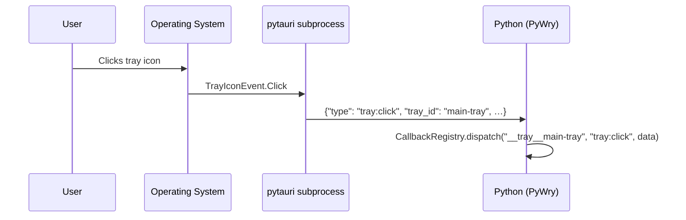

# System Tray

PyWry provides system tray (notification area) support — icons, tooltips, menus, and click/hover events — through `TrayProxy`, which communicates with the Tauri tray API over IPC.

Tray icons are **app-level** — not tied to any window. They persist until explicitly removed or the app is destroyed.

---

## Quick Start

A tray icon with a menu that toggles a paused/running state and updates the tooltip in real time:

```python
from pywry import PyWry, MenuConfig, MenuItemConfig, TrayIconConfig
from pywry.tray_proxy import TrayProxy

app = PyWry()
paused = False


def toggle_pause(data, event_type, label):
    global paused
    paused = not paused
    status = "Paused" if paused else "Running"
    tray.set_tooltip(f"My App — {status}")


def quit_app(data, event_type, label):
    tray.remove()
    app.destroy()


tray = TrayProxy.from_config(TrayIconConfig(
    id="main-tray",
    tooltip="My App — Running",
    menu=MenuConfig(id="tray-menu", items=[
        MenuItemConfig(id="toggle", text="Pause / Resume", handler=toggle_pause),
        MenuItemConfig(id="quit", text="Quit", handler=quit_app),
    ]),
))
```

`from_config()` automatically wires `on_click`, `on_double_click`, `on_right_click`, and all menu item `handler` callbacks.

---

## Three Ways to Create a Tray

### 1. `TrayProxy.from_config()` — declarative, recommended

Shown above in the Quick Start. Handlers live on the config object; `from_config()` registers them for you.

### 2. `app.create_tray()` — tracked by the app

The `PyWry` instance tracks the tray so `app.destroy()` cleans it up. Use `tray.on()` to add event handlers after creation:

```python
app = PyWry()
handle = app.show("<h1>Dashboard</h1>", title="Dashboard", label="dash")

tray = app.create_tray(
    tray_id="dash-tray",
    tooltip="Dashboard — Click to focus",
)

# Left-click the tray icon → bring the window to front
tray.on("tray:click", lambda data, evt, lbl: (handle.show(), handle.set_focus()))
```

### 3. `TrayProxy.create()` — low-level, no config object

Useful for headless services where you just need a presence in the notification area:

```python
from pywry.tray_proxy import TrayProxy

tray = TrayProxy.create(tray_id="worker", tooltip="Worker idle")

# Update the tooltip as work progresses
tray.set_tooltip("Worker — processing 3 / 10")
```

---

## TrayIconConfig Reference

| Parameter | Type | Default | Description |
|:---|:---|:---|:---|
| `id` | `str` | *required* | Unique identifier |
| `tooltip` | `str` &#124; `None` | `None` | Hover tooltip text |
| `title` | `str` &#124; `None` | `None` | Title text (macOS menu bar) |
| `icon` | `bytes` &#124; `None` | `None` | RGBA icon bytes. Falls back to the bundled app icon. |
| `icon_width` | `int` | `32` | Icon width in pixels |
| `icon_height` | `int` | `32` | Icon height in pixels |
| `menu` | `MenuConfig` &#124; `None` | `None` | Attached context menu |
| `menu_on_left_click` | `bool` | `True` | Show menu on left click |
| `on_click` | `Callable` &#124; `None` | `None` | Single-click handler |
| `on_double_click` | `Callable` &#124; `None` | `None` | Double-click handler |
| `on_right_click` | `Callable` &#124; `None` | `None` | Right-click handler |

---

## Updating a Live Tray Icon

Every setter fires an IPC command and updates the OS tray immediately:

```python
# Tooltip
tray.set_tooltip("Downloading… 42 %")

# Title (macOS menu bar text)
tray.set_title("v2.1.0")

# Icon (raw RGBA bytes)
tray.set_icon(rgba_bytes, width=32, height=32)

# Visibility
tray.set_visible(False)   # hide
tray.set_visible(True)    # show again

# Left-click behavior
tray.set_menu_on_left_click(False)  # left click fires tray:click instead of opening menu
```

### Swapping the Menu at Runtime

Replace the menu to reflect application state changes — for example toggling between signed-in and signed-out states:

```python
from pywry import PyWry, MenuConfig, MenuItemConfig, TrayIconConfig
from pywry.tray_proxy import TrayProxy

app = PyWry()


def sign_out(data, event_type, label):
    tray.set_menu(signed_out_menu)
    tray.set_tooltip("App — signed out")


def sign_in(data, event_type, label):
    tray.set_menu(signed_in_menu)
    tray.set_tooltip("App — dangl@github.com")


def quit_app(data, event_type, label):
    tray.remove()
    app.destroy()


signed_out_menu = MenuConfig(id="m-out", items=[
    MenuItemConfig(id="login", text="Sign in…", handler=sign_in),
    MenuItemConfig(id="quit-out", text="Quit", handler=quit_app),
])

signed_in_menu = MenuConfig(id="m-in", items=[
    MenuItemConfig(id="logout", text="Sign out", handler=sign_out),
    MenuItemConfig(id="quit-in", text="Quit", handler=quit_app),
])

tray = TrayProxy.from_config(TrayIconConfig(
    id="auth-tray",
    tooltip="App — signed out",
    menu=signed_out_menu,
))
```

---

## Tray Events

| Event | Trigger |
|:---|:---|
| `tray:click` | Single click on the tray icon |
| `tray:double-click` | Double click |
| `tray:right-click` | Right click |
| `tray:enter` | Cursor enters icon area |
| `tray:leave` | Cursor leaves icon area |
| `tray:move` | Cursor moves over icon area |

### Event Data Shape

Click events include:

```python
{
    "button": "Left" | "Right" | "Middle",
    "state": "Up" | "Down",
    "position": {"x": float, "y": float},
}
```

### Event Flow



!!! note "Menu item clicks"
    Menu item clicks flow through the `menu:click` event dispatched on the synthetic label `__tray__<tray_id>`. When using `from_config()`, item handlers are wired automatically — you don't need to use `tray.on("menu:click", ...)` yourself.

---

## Multiple Tray Icons

Each icon has its own ID, menu, and event handlers:

```python
from pywry import PyWry, MenuConfig, MenuItemConfig, TrayIconConfig
from pywry.tray_proxy import TrayProxy

app = PyWry()
counter = 0


def increment(data, event_type, label):
    global counter
    counter += 1
    app_tray.set_tooltip(f"Clicks: {counter}")


def reset(data, event_type, label):
    global counter
    counter = 0
    app_tray.set_tooltip("Clicks: 0")


app_tray = TrayProxy.from_config(TrayIconConfig(
    id="app",
    tooltip="Clicks: 0",
    on_click=increment,
    menu=MenuConfig(id="app-menu", items=[
        MenuItemConfig(id="reset", text="Reset counter", handler=reset),
    ]),
))

# A second, independent tray icon for a background task
job_tray = TrayProxy.create(tray_id="jobs", tooltip="No active jobs")
```

---

## Removing Tray Icons

```python
tray.remove()             # remove a single icon via its proxy
app.remove_tray("main")   # remove by ID (works for any creation method)
app.destroy()             # removes ALL tray icons + closes all windows
```

---

## Minimize-to-Tray Pattern

The most common tray use case: hide the window on close, restore it from the tray.

```python
from pywry import PyWry, MenuConfig, MenuItemConfig, TrayIconConfig
from pywry.tray_proxy import TrayProxy

app = PyWry()
handle = app.show(
    "<h1>Dashboard</h1><p>Close this window — it hides to tray.</p>",
    title="Dashboard",
    label="main",
)

hidden = False


def restore(data, event_type, label):
    global hidden
    handle.show()
    handle.set_focus()
    hidden = False
    tray.set_tooltip("Dashboard — visible")


def quit_app(data, event_type, label):
    tray.remove()
    app.destroy()


tray = TrayProxy.from_config(TrayIconConfig(
    id="app-tray",
    tooltip="Dashboard — visible",
    on_click=restore,
    menu=MenuConfig(id="tray-menu", items=[
        MenuItemConfig(id="show", text="Show window", handler=restore),
        MenuItemConfig(id="quit", text="Quit", handler=quit_app),
    ]),
))


def on_close_requested(data, event_type, label):
    global hidden
    handle.hide()
    hidden = True
    tray.set_tooltip("Dashboard — hidden (click tray to restore)")


handle.on("window:close-requested", on_close_requested)
```

---

## Long-Running Task with Progress

Use the tray to report progress from a background thread:

```python
import threading
import time
from pywry import PyWry, MenuConfig, MenuItemConfig, TrayIconConfig
from pywry.tray_proxy import TrayProxy

app = PyWry()
cancel = threading.Event()


def do_work():
    for i in range(1, 101):
        if cancel.is_set():
            tray.set_tooltip("Task cancelled")
            return
        tray.set_tooltip(f"Processing… {i}%")
        time.sleep(0.1)
    tray.set_tooltip("Done ✓")


def start_task(data, event_type, label):
    cancel.clear()
    threading.Thread(target=do_work, daemon=True).start()


def cancel_task(data, event_type, label):
    cancel.set()


def quit_app(data, event_type, label):
    cancel.set()
    tray.remove()
    app.destroy()


tray = TrayProxy.from_config(TrayIconConfig(
    id="worker-tray",
    tooltip="Idle",
    menu=MenuConfig(id="worker-menu", items=[
        MenuItemConfig(id="start", text="Start task", handler=start_task),
        MenuItemConfig(id="cancel", text="Cancel", handler=cancel_task),
        MenuItemConfig(id="quit", text="Quit", handler=quit_app),
    ]),
))
```
