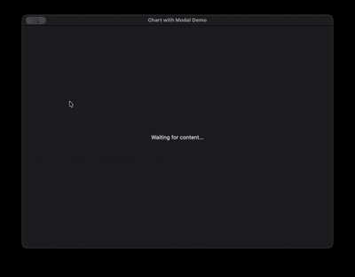

# PyWry

A rendering library for native desktop windows, Jupyter widgets, and browser tabs with bidirectional Python-JavaScript communication.

**Not a dashboard framework** — a rendering engine with three output paths from one API:

| Mode | Environment | Backend |
|------|-------------|---------|
| `NEW_WINDOW` / `SINGLE_WINDOW` / `MULTI_WINDOW` | Native OS window | PyTauri (Tauri/Rust) + OS webview |
| `NOTEBOOK` | Jupyter / VS Code / Colab | anywidget or IFrame + FastAPI |
| `BROWSER` | System browser tab | FastAPI + WebSocket |

Built on [PyTauri](https://pypi.org/project/pytauri/) using Rust's Tauri framework. Uses OS webview instead of bundling a browser — a few MBs vs Electron's 150MB+.



## Install

```bash
pip install pywry
```

## Hello World

```python
from pywry import PyWry

app = PyWry()
app.show("Hello World!")
app.block()
```

## Interactive Example

```python
from pywry import PyWry, Toolbar, Button

app = PyWry()

def on_click(data, event_type, label):
    app.emit("pywry:set-content", {"selector": "h1", "text": "Clicked!"}, label)

toolbar = Toolbar(position="top", items=[Button(label="Update Text", event="app:click")])

app.show(
    "<h1>Hello, World!</h1>",
    toolbars=[toolbar],
    callbacks={"app:click": on_click},
)
```

## DataFrame with AgGrid

```python
from pywry import PyWry
import pandas as pd

app = PyWry()
df = pd.DataFrame({"name": ["Alice", "Bob", "Carol"], "age": [30, 25, 35]})

def on_select(data, event_type, label):
    names = ", ".join(row["name"] for row in data["rows"])
    app.emit("pywry:alert", {"message": f"Selected: {names}"}, label)

app.show_dataframe(df, callbacks={"grid:row-selected": on_select})
```

## Plotly Chart

```python
from pywry import PyWry, Toolbar, Button
import plotly.express as px

app = PyWry(theme="light")
fig = px.scatter(px.data.iris(), x="sepal_width", y="sepal_length", color="species")

def on_click(data, event_type, label):
    point = data["points"][0]
    app.emit("plotly:update-layout", {"layout": {"title": f"({point['x']:.2f}, {point['y']:.2f})"}}, label)

def on_reset(data, event_type, label):
    app.emit("plotly:reset-zoom", {}, label)

app.show_plotly(
    fig,
    toolbars=[Toolbar(position="top", items=[Button(label="Reset Zoom", event="app:reset")])],
    callbacks={"plotly:click": on_click, "app:reset": on_reset},
)
```

## Documentation

<div class="nav-cards">
  <a href="getting-started/installation/" class="nav-card">
    <h4>Installation</h4>
    <p>Install and setup</p>
  </a>
  <a href="getting-started/quickstart/" class="nav-card">
    <h4>Quick Start</h4>
    <p>First window in 5 min</p>
  </a>
  <a href="getting-started/rendering-paths/" class="nav-card">
    <h4>Rendering Paths</h4>
    <p>Native, Notebook, Browser</p>
  </a>
  <a href="guides/events/" class="nav-card">
    <h4>Event System</h4>
    <p>Python-JS communication</p>
  </a>
  <a href="guides/toolbars/" class="nav-card">
    <h4>Toolbar System</h4>
    <p>18 declarative components</p>
  </a>
  <a href="reference/" class="nav-card">
    <h4>API Reference</h4>
    <p>Full API docs</p>
  </a>
</div>
