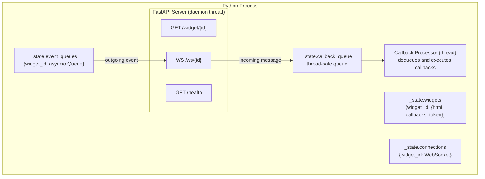

# IFrame + WebSocket Transport

PyWry's event system uses a unified protocol — `on()`, `emit()`, `update()`, `display()` — that works identically across native windows, IFrame+WebSocket, and anywidget. This page explains how that protocol is implemented over the IFrame+WebSocket transport, so you can build reusable components or introduce new integrations that work seamlessly in all three environments.

For the anywidget transport, see [Anywidget Transport](../anywidget/index.md).

## How InlineWidget Implements the Protocol

In IFrame mode, `InlineWidget` implements `BaseWidget` by mapping each method to a FastAPI server and WebSocket connection:

| BaseWidget Method | InlineWidget Implementation |
|-------------------|---------------------------|
| `emit(type, data)` | Serialize `{type, data, ts}` → enqueue onto `event_queues[widget_id]` → WebSocket sender loop pushes to browser |
| `on(type, callback)` | Store callback in `_callbacks[type]` dict → `_route_ws_message` dispatches from WebSocket |
| `update(html)` | Store new HTML in `_state.widgets` → browser reloads on next `pywry:update-html` event |
| `display()` | Render an IPython `IFrame` pointing to `http://host:port/widget/{widget_id}` |

## Server Architecture

A single FastAPI server runs per Python process. All widgets share it.



The server starts automatically on the first `InlineWidget` creation. The callback queue bridges the async/sync boundary — WebSocket handlers run on the asyncio event loop, but user callbacks are synchronous Python functions.

### HTML Page Structure

When the IFrame loads `GET /widget/{widget_id}`, the server returns:

```html
<!DOCTYPE html>
<html class="dark">
<head>
    {pywry CSS variables and base styles}
    <script>{ws-bridge.js with widget_id and token injected}</script>
    <script>{toast-notifications.js}</script>
    {plotly.js, ag-grid.js, etc. if needed}
    {toolbar handler scripts if toolbars present}
</head>
<body>
    <div class="pywry-widget pywry-theme-dark">
        {your HTML content}
    </div>
</body>
</html>
```

The `ws-bridge.js` template has three placeholders replaced at serve time:

- `__WIDGET_ID__` → the widget's UUID
- `__WS_AUTH_TOKEN__` → per-widget authentication token (or `null`)
- `__PYWRY_DEBUG__` → `true` or `false`

## WebSocket Protocol

### Connection and Authentication

On page load, `ws-bridge.js` opens a WebSocket:

```
ws://localhost:8765/ws/{widget_id}
```

If token auth is enabled (default), the token is sent in the `Sec-WebSocket-Protocol` header as `pywry.token.{token}`. The server validates the token before accepting the connection. Invalid tokens receive close code `4001`.

After two consecutive auth failures, the browser automatically reloads the page to get a fresh token.

### Event Wire Format

Both directions use the same JSON structure:

**JS → Python:**
```json
{"type": "app:click", "data": {"x": 100}, "widgetId": "abc123", "ts": 1234567890}
```

**Python → JS:**
```json
{"type": "pywry:set-content", "data": {"id": "status", "text": "Done"}, "ts": "a1b2c3"}
```

### JS → Python Path

```
pywry.emit("form:submit", {name: "Alice"})
  → JSON.stringify({type, data, widgetId, ts})
  → WebSocket.send(json_string)
  → FastAPI websocket_endpoint receives message
  → _route_ws_message(widget_id, msg)
  → lookup callbacks in _state.widgets[widget_id]
  → _state.callback_queue.put((callback, data, event_type, widget_id))
  → callback processor thread dequeues and executes
  → callback(data, "form:submit", widget_id)
```

### Python → JS Path

```
widget.emit("pywry:set-content", {"id": "status", "text": "Done"})
  → serialize {type, data, ts}
  → asyncio.run_coroutine_threadsafe(queue.put(event), server_loop)
  → _ws_sender_loop pulls from event_queues[widget_id]
  → websocket.send_json(event)
  → ws-bridge.js receives message
  → pywry._fire(type, data)
  → registered on() listeners execute
```

### Reconnection

If the WebSocket drops, `ws-bridge.js` reconnects with exponential backoff (1s → 2s → 4s → max 10s). During disconnection, `pywry.emit()` calls queue in `_msgQueue` and flush on reconnect.

### Page Unload

When the user closes the tab or navigates away:

1. Secret input values are cleared from the DOM
2. A `pywry:disconnect` event is sent over WebSocket
3. `navigator.sendBeacon` posts to `/disconnect/{widget_id}` as fallback
4. Server fires `pywry:disconnect` callback if registered and cleans up state

## The `pywry` Bridge Object

`ws-bridge.js` creates `window.pywry` with the same interface as the anywidget ESM bridge:

| Method | Description |
|--------|-------------|
| `emit(type, data)` | Send event to Python over WebSocket |
| `on(type, callback)` | Register listener for events from Python |
| `_fire(type, data)` | Dispatch locally to `on()` listeners |
| `result(data)` | Shorthand for `emit("pywry:result", data)` |
| `send(data)` | Shorthand for `emit("pywry:message", data)` |

The bridge also pre-registers handlers for all built-in `pywry:*` events — CSS injection, content updates, theme switching, downloads, alerts, navigation. These are the same events handled by the anywidget ESM.

## Building a Reusable Component

The same component code works on both transports because both create the same `pywry` bridge. A component needs:

### Python: A State Mixin

```python
from pywry.state_mixins import EmittingWidget


class ProgressMixin(EmittingWidget):
    """Adds a progress bar that syncs between Python and JavaScript."""

    def set_progress(self, value: float, label: str = ""):
        self.emit("progress:update", {"value": value, "label": label})

    def complete(self):
        self.emit("progress:complete", {})
```

This mixin works with any widget that implements `emit()` — `PyWryWidget`, `InlineWidget`, or `NativeWindowHandle`.

### JavaScript: Event Listeners

```javascript
pywry.on('progress:update', function(data) {
    var bar = document.getElementById('progress-bar');
    bar.style.width = data.value + '%';
    var label = document.getElementById('progress-label');
    if (label) label.textContent = data.label || (data.value + '%');
});

pywry.on('progress:complete', function() {
    var bar = document.getElementById('progress-bar');
    bar.style.width = '100%';
    bar.style.backgroundColor = '#a6e3a1';
});
```

This JavaScript runs identically in:

- **Anywidget ESM** — the local `pywry` object writes to traitlets
- **IFrame ws-bridge.js** — the local `pywry` object writes to WebSocket
- **Native bridge.js** — the local `pywry` object writes to Tauri IPC

### HTML Content

```python
progress_html = """
<div style="padding: 20px">
    <div style="background: #313244; border-radius: 4px; overflow: hidden">
        <div id="progress-bar" style="height: 24px; background: #89b4fa; width: 0%; transition: width 0.3s"></div>
    </div>
    <div id="progress-label" style="text-align: center; margin-top: 8px; color: #cdd6f4"></div>
</div>
"""

widget = app.show(HtmlContent(html=progress_html))
widget.set_progress(0)      # Works on anywidget
widget.set_progress(50)     # Works on IFrame+WebSocket
widget.complete()           # Works on native window
```

## Multiple Widgets

Each widget gets its own WebSocket connection and event queue. Events are routed by `widget_id` — there is no crosstalk between widgets:

```python
chart = app.show_plotly(fig)
table = app.show_dataframe(df)

chart.on("plotly:click", handle_chart_click)
table.on("grid:cell-click", handle_cell_click)

chart.emit("plotly:update-layout", {"layout": {"title": "Updated"}})
# Only the chart widget receives this — table is unaffected
```

## Security

| Mechanism | How It Works |
|-----------|-------------|
| **Per-widget token** | Generated at creation, injected into HTML, sent via `Sec-WebSocket-Protocol` header, validated before accepting WebSocket |
| **Origin validation** | Optional `websocket_allowed_origins` list checked on WebSocket upgrade |
| **Auto-refresh** | Two consecutive auth failures trigger page reload for fresh token |
| **Secret clearing** | `beforeunload` event clears revealed password/secret input values from DOM |

## Deploy Mode (Redis Backend)

In production with multiple Uvicorn workers:

- Widget HTML and tokens are stored in Redis instead of `_state.widgets`
- Callbacks register in a shared callback registry
- Event queues remain per-process (WebSocket connections are worker-local)
- Widget registration uses HTTP POST to ensure the correct worker handles it

The developer-facing API is unchanged. The same `widget.on()` and `widget.emit()` calls work regardless of whether state is in-memory or in Redis.

## Transport Comparison

| Aspect | IFrame+WebSocket | Anywidget | Native Window |
|--------|------------------|-----------|---------------|
| `pywry.emit()` | WebSocket send | Traitlet `_js_event` | Tauri IPC `pyInvoke` |
| `pywry.on()` | Local handler dict | Local handler dict | Local handler dict |
| Python `emit()` | Async queue → WS send | Traitlet `_py_event` | Tauri event emit |
| Python `on()` | Callback dict lookup | Traitlet observer | Callback dict lookup |
| Asset loading | HTTP `<script>` injection | Bundled in `_esm` or `_asset_js` trait | Bundled in page HTML |
| Server required | Yes (FastAPI) | No | No (subprocess IPC) |
| Multiple widgets | Shared server, per-widget WS | Each independent | Each is a window |

The Python-facing API (`on`, `emit`, `update`, `display`) and the JavaScript-facing API (`pywry.emit`, `pywry.on`, `pywry._fire`) are identical in every column. A component built against these interfaces works everywhere.
