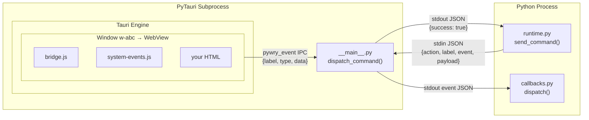

# PyTauri Transport

PyWry's event system uses a unified protocol — `on()`, `emit()`, `update()`, `display()` — that works identically across PyTauri, IFrame+WebSocket, and anywidget. This page explains how that protocol is implemented over the PyTauri transport, so you can build reusable components that work seamlessly in all three environments.

For the other transports, see [Anywidget Transport](../anywidget/index.md) and [IFrame + WebSocket Transport](../inline-widget/index.md).

## Architecture

PyTauri runs a Rust subprocess that manages OS webview windows. Python communicates with this subprocess over stdin/stdout JSON IPC.



Each window runs the same `bridge.js` and `system-events.js` scripts that the other transports use, providing the same `window.pywry` bridge object.

## How NativeWindowHandle Implements the Protocol

| BaseWidget Method | Native Implementation |
|-------------------|----------------------|
| `emit(type, data)` | `runtime.emit_event(label, type, data)` → stdin JSON `{action:"emit"}` → Tauri emits `pywry:event` to the window → `bridge.js` `_trigger(type, data)` dispatches to JS listeners |
| `on(type, callback)` | `callbacks.get_registry().register(label, type, callback)` → when JS calls `pywry.emit()`, Tauri invokes `pywry_event` IPC → `handle_pywry_event` dispatches via callback registry |
| `update(html)` | `lifecycle.set_content(label, html)` → builds new HTML page → replaces window content via Tauri |
| `display()` | No-op — native windows are visible immediately on creation |

### Additional Native Methods

`NativeWindowHandle` provides methods beyond `BaseWidget` that are only available in native mode:

| Method | Description |
|--------|-------------|
| `eval_js(script)` | Execute arbitrary JavaScript in the window |
| `close()` | Destroy the window |
| `hide()` / `show_window()` | Toggle visibility without destroying |
| `proxy` | Returns a `WindowProxy` for full Tauri WebviewWindow API access |

The `WindowProxy` exposes the complete Tauri window control surface — maximize, minimize, fullscreen, set title, set size, set position, set background color, set always-on-top, open devtools, set zoom level, navigate to URL, and more. These are native OS operations that have no equivalent in the notebook transports.

## IPC Message Protocol

### Python → Subprocess (stdin)

Python sends JSON commands to the subprocess via stdin. Each command is a single JSON object on one line:

```json
{"action": "emit", "label": "w-abc123", "event": "pywry:set-content", "payload": {"id": "status", "text": "Done"}}
```

| Action | Fields | Effect |
|--------|--------|--------|
| `create` | `label`, `url`, `html`, `title`, `width`, `height`, `theme` | Create a new window |
| `emit` | `label`, `event`, `payload` | Emit event to window's JavaScript |
| `eval_js` | `label`, `script` | Execute JavaScript in window |
| `close` | `label` | Close and destroy window |
| `hide` | `label` | Hide window |
| `show` | `label` | Show hidden window |
| `set_content` | `label`, `html` | Replace window HTML |
| `set_theme` | `label`, `theme` | Switch dark/light theme |

The subprocess responds with `{"success": true}` or `{"success": false, "error": "..."}` on stdout.

### Subprocess → Python (stdout)

When JavaScript calls `pywry.emit()` in a window, the event flows:

1. `bridge.js` calls `window.__TAURI__.pytauri.pyInvoke('pywry_event', payload)`
2. Tauri routes the IPC call to `handle_pywry_event(label, event_data)` in the subprocess
3. `handle_pywry_event` dispatches to the subprocess callback registry
4. The event is also written to stdout as JSON for the parent process
5. The parent process's reader thread picks it up and dispatches via `callbacks.get_registry()`

The stdout event format:

```json
{"type": "event", "label": "w-abc123", "event_type": "app:click", "data": {"x": 100}}
```

### Request-Response Correlation

For blocking operations (like `eval_js` that needs a return value), the command includes a `request_id`. The subprocess echoes this ID in the response, and `send_command_with_response()` matches them:

```python
cmd = {"action": "eval_js", "label": "w-abc", "script": "document.title", "request_id": "req_001"}
# stdin → subprocess executes → stdout response includes request_id
response = {"success": True, "result": "My Window", "request_id": "req_001"}
```

For fire-and-forget events (high-frequency streaming), `emit_event_fire()` sends the command without waiting for a response, draining stale responses to prevent queue buildup.

## The `pywry` Bridge in Native Windows

Native windows load `bridge.js` from `frontend/src/bridge.js` during page initialization. This creates the same `window.pywry` object as the other transports:

| Method | Native Implementation |
|--------|----------------------|
| `pywry.emit(type, data)` | Calls `window.__TAURI__.pytauri.pyInvoke('pywry_event', {label, event_type, data})` — Tauri IPC to Rust subprocess |
| `pywry.on(type, callback)` | Stores in local `_handlers` dict |
| `pywry._trigger(type, data)` | Dispatches to local `_handlers` + wildcard handlers |
| `pywry.dispatch(type, data)` | Alias for `_trigger` |
| `pywry.result(data)` | Calls `pyInvoke('pywry_result', {data, window_label})` |

When Python calls `handle.emit("app:update", data)`, the subprocess emits a Tauri event named `pywry:event` to the target window. The `event-bridge.js` script listens for this:

```javascript
window.__TAURI__.event.listen('pywry:event', function(event) {
    var eventType = event.payload.event_type;
    var data = event.payload.data;
    window.pywry._trigger(eventType, data);
});
```

This triggers the same `_trigger()` dispatch as the other transports, so `pywry.on()` listeners work identically.

## Building Components That Work Everywhere

A reusable component uses the `BaseWidget` protocol and never calls transport-specific APIs. The same Python mixin + JavaScript event handlers work in all three environments:

```python
from pywry.state_mixins import EmittingWidget


class NotificationMixin(EmittingWidget):
    def notify(self, title: str, body: str, level: str = "info"):
        self.emit("pywry:alert", {
            "message": body,
            "title": title,
            "type": level,
        })

    def confirm(self, question: str, callback_event: str):
        self.emit("pywry:alert", {
            "message": question,
            "type": "confirm",
            "callback_event": callback_event,
        })
```

This mixin calls `self.emit()`, which resolves to:

- **Native**: `runtime.emit_event()` → stdin JSON → Tauri event → `bridge.js` `_trigger()`
- **Anywidget**: `_py_event` traitlet → Jupyter sync → ESM `pywry._fire()`
- **IFrame**: `event_queues[widget_id].put()` → WebSocket send → `ws-bridge.js` `_fire()`

The JavaScript toast handler is pre-registered in all three bridges, so `pywry:alert` works everywhere.

## PyTauri and Plugins

The native transport runs on [PyTauri](https://pytauri.github.io/pytauri/), which is distributed as a vendored wheel (`pytauri-wheel`). PyTauri provides:

- OS-native webview windows (WKWebView on macOS, WebView2 on Windows, WebKitGTK on Linux)
- Tauri's plugin system for native capabilities
- JSON-over-stdin/stdout IPC between Python and the Rust subprocess

### Enabling Tauri Plugins

Tauri plugins extend native windows with OS-level capabilities — clipboard access, native dialogs, filesystem operations, notifications, HTTP client, global shortcuts, and more. Enable them via configuration:

```python
from pywry import PyWry, PyWrySettings

app = PyWry(settings=PyWrySettings(
    tauri_plugins=["dialog", "clipboard_manager", "notification"],
))
```

Once enabled, the plugin's JavaScript API is available through `window.__TAURI__` in the window:

```javascript
// Native file dialog
const { open } = window.__TAURI__.dialog;
const path = await open({ multiple: false });

// Clipboard
const { writeText } = window.__TAURI__.clipboardManager;
await writeText("Copied from PyWry");
```

Plugins are only available in native mode — they have no effect in anywidget or IFrame transports. Components that use plugins should check for availability:

```javascript
if (window.__TAURI__ && window.__TAURI__.dialog) {
    // Native: use OS dialog
    const path = await window.__TAURI__.dialog.open();
    pywry.emit('file:selected', {path: path});
} else {
    // Notebook/browser: use HTML file input
    document.getElementById('file-input').click();
}
```

See the [Tauri Plugins reference](tauri-plugins.md) for the full list of 19 available plugins, capability configuration, and detailed examples.

### Plugin Security (Capabilities)

Tauri uses a capability system to control which APIs a window can call. PyWry grants `:default` permissions for all bundled plugins. For fine-grained control:

```python
settings = PyWrySettings(
    tauri_plugins=["shell", "fs"],
    extra_capabilities=["shell:allow-execute", "fs:allow-read-file"],
)
```

## Native-Only Features

The PyTauri transport provides OS-level capabilities that have no equivalent in the notebook or browser transports. These features require the PyTauri subprocess and only work when `app.show()` renders a native desktop window.

### Native Menus

Native application menus (File, Edit, View, Help) render in the OS menu bar on macOS and in the window title bar on Windows and Linux. Menus are built from `MenuConfig`, `MenuItemConfig`, `CheckMenuItemConfig`, and `SubmenuConfig` objects, each with a Python callback:

```python
from pywry import PyWry, MenuConfig, MenuItemConfig, SubmenuConfig, PredefinedMenuItemConfig, PredefinedMenuItemKind

app = PyWry()

def on_new(data, event_type, label):
    app.show("<h1>Untitled</h1>", title="New File")

def on_save(data, event_type, label):
    app.emit("app:save", {"path": "current.json"}, label)

def on_quit(data, event_type, label):
    app.destroy()

menu = MenuConfig(
    id="app-menu",
    items=[
        SubmenuConfig(text="File", items=[
            MenuItemConfig(id="new", text="New", handler=on_new, accelerator="CmdOrCtrl+N"),
            MenuItemConfig(id="save", text="Save", handler=on_save, accelerator="CmdOrCtrl+S"),
            PredefinedMenuItemConfig(item=PredefinedMenuItemKind.SEPARATOR),
            MenuItemConfig(id="quit", text="Quit", handler=on_quit, accelerator="CmdOrCtrl+Q"),
        ]),
    ],
)

handle = app.show("<h1>Editor</h1>", menu=menu)
```

Menu items fire their `handler` callback when clicked. Keyboard accelerators (`CmdOrCtrl+S`, etc.) work globally while the window has focus.

`CheckMenuItemConfig` creates toggle items with a checkmark state. The callback receives `{"checked": true/false}` in the event data.

See [Native Menus](../../guides/menus.md) for the full menu system documentation.

### System Tray

`TrayProxy` creates an icon in the OS system tray (notification area on Windows, menu bar on macOS). The tray icon can show a tooltip, a context menu, and respond to click events:

```python
from pywry import TrayProxy, MenuConfig, MenuItemConfig

def on_show(data, event_type, label):
    handle.show_window()

def on_quit(data, event_type, label):
    app.destroy()

tray = TrayProxy.create(
    tray_id="my-tray",
    tooltip="My App",
    menu=MenuConfig(
        id="tray-menu",
        items=[
            MenuItemConfig(id="show", text="Show Window", handler=on_show),
            MenuItemConfig(id="quit", text="Quit", handler=on_quit),
        ],
    ),
)
```

The tray icon persists even when all windows are hidden, making it useful for background applications that need to remain accessible.

See [System Tray](../../guides/tray.md) for the full tray API.

### Window Control

`NativeWindowHandle` provides direct control over the OS window through the `WindowProxy` API. These operations have no equivalent in notebook or browser environments:

```python
handle = app.show("<h1>Dashboard</h1>", title="My App")

handle.set_title("Updated Title")
handle.set_size(1200, 800)
handle.center()
handle.maximize()
handle.minimize()
handle.set_focus()

handle.hide()
handle.show_window()
handle.close()
```

The full `WindowProxy` (accessed via `handle.proxy`) exposes every Tauri `WebviewWindow` method:

| Category | Methods |
|----------|---------|
| **State** | `is_maximized`, `is_minimized`, `is_fullscreen`, `is_focused`, `is_visible`, `is_decorated` |
| **Actions** | `maximize()`, `unmaximize()`, `minimize()`, `unminimize()`, `set_fullscreen()`, `center()` |
| **Size** | `set_size()`, `set_min_size()`, `set_max_size()`, `inner_size`, `outer_size` |
| **Position** | `set_position()`, `inner_position`, `outer_position` |
| **Appearance** | `set_title()`, `set_decorations()`, `set_background_color()`, `set_always_on_top()`, `set_content_protected()` |
| **Webview** | `eval_js()`, `navigate()`, `reload()`, `open_devtools()`, `close_devtools()`, `set_zoom()`, `zoom` |

### JavaScript Execution

`eval_js()` runs arbitrary JavaScript in the window's webview. This is useful for DOM queries, dynamic updates, and debugging:

```python
handle.eval_js("document.getElementById('counter').textContent = '42'")
handle.eval_js("document.title = 'Updated from Python'")
```

### Multi-Window Communication

In native mode, each `app.show()` call creates an independent OS window with its own label. Python code can target events to specific windows using the `label` parameter on `app.emit()`:

```python
chart_handle = app.show(chart_html, title="Chart")
table_handle = app.show(table_html, title="Data")

def on_row_selected(data, event_type, label):
    selected = data["rows"]
    filtered_fig = build_chart(selected)
    app.emit("plotly:update-figure", {"figure": filtered_fig}, chart_handle.label)

table_handle.on("grid:row-selected", on_row_selected)
```

Window events are routed by label — each window receives only the events targeted at it. The callback registry maps `(label, event_type)` pairs to callbacks, so the same event name can have different handlers in different windows.

### Window Modes

PyWry offers three strategies for managing native windows:

| Mode | Behavior |
|------|----------|
| `SingleWindowMode` | One window at a time. Calling `show()` again replaces the content in the existing window. |
| `NewWindowMode` | Each `show()` creates a new window. Multiple windows can be open simultaneously. |
| `MultiWindowMode` | Like `NewWindowMode` but with coordinated lifecycle — closing the primary window closes all secondary windows. |

```python
from pywry import PyWry
from pywry.window_manager import NewWindowMode

app = PyWry(mode=NewWindowMode())

h1 = app.show("<h1>Window 1</h1>", title="First")
h2 = app.show("<h1>Window 2</h1>", title="Second")
```

See [Window Modes](../../guides/window-management.md) for details on each mode.

### Hot Reload

In native mode, PyWry can watch CSS and JavaScript files for changes and push updates to the window without a full page reload:

```python
from pywry import PyWry, HtmlContent

app = PyWry(hot_reload=True)

content = HtmlContent(
    html="<h1>Dashboard</h1>",
    css_files=["styles/dashboard.css"],
    script_files=["scripts/chart.js"],
)

handle = app.show(content)
```

When `dashboard.css` changes on disk, PyWry injects the updated CSS via `pywry:inject-css` without reloading the page. Script file changes trigger a full page refresh with scroll position preservation.

See [Hot Reload](../../guides/hot-reload.md) for configuration details.

## Transport Comparison

| Aspect | Native Window | Anywidget | IFrame+WebSocket |
|--------|---------------|-----------|------------------|
| `pywry.emit()` | Tauri IPC `pyInvoke` | Traitlet `_js_event` | WebSocket send |
| `pywry.on()` | Local handler dict | Local handler dict | Local handler dict |
| Python `emit()` | stdin JSON → Tauri event | Traitlet `_py_event` | Async queue → WS |
| Python `on()` | Callback registry | Traitlet observer | Callback dict |
| Asset loading | Bundled in page HTML | Bundled in `_esm` | HTTP `<script>` |
| Server required | No (subprocess IPC) | No | Yes (FastAPI) |
| OS features | Full (Tauri plugins) | None | None |
| Multiple widgets | Multiple windows | Each independent | Shared server |

The Python-facing API (`on`, `emit`, `update`, `display`) and the JavaScript-facing API (`pywry.emit`, `pywry.on`, `pywry._fire`) are identical across all three transports.
