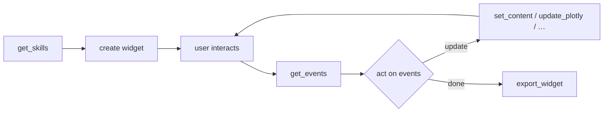

# Examples

Real-world workflows showing how an AI agent uses the MCP tools together.
Each example shows the exact JSON tool calls the agent makes and explains the pattern.

!!! tip "Agent best practice"
    Before building any widget, the agent should call `get_skills` to fetch the
    `component_reference` skill. That skill contains the full property tables,
    event signatures, and JSON schemas for every toolbar component.

---

## Plotly Charts

### Scatter Plot

**Prompt:** *Create a scatter plot — hours studied vs test scores.*

```json title="show_plotly"
{
  "figure_json": "{\"data\":[{\"x\":[1,2,3,4,5,6,7,8],\"y\":[52,58,65,72,78,82,88,92],\"type\":\"scatter\",\"mode\":\"markers\",\"marker\":{\"size\":10,\"color\":\"#3b82f6\"}}],\"layout\":{\"title\":\"Hours Studied vs Test Scores\",\"xaxis\":{\"title\":\"Hours Studied\"},\"yaxis\":{\"title\":\"Test Score\"}}}"
}
```

`figure_json` is always a **JSON string**, not a nested object.
In Python you would pass `fig.to_json()`.

### Bar Chart

**Prompt:** *Bar chart of Q1 sales: North $120k, South $95k, East $110k, West $85k.*

```json title="show_plotly"
{
  "figure_json": "{\"data\":[{\"x\":[\"North\",\"South\",\"East\",\"West\"],\"y\":[120000,95000,110000,85000],\"type\":\"bar\",\"marker\":{\"color\":[\"#3b82f6\",\"#10b981\",\"#f59e0b\",\"#ef4444\"]}}],\"layout\":{\"title\":\"Q1 Sales by Region\",\"yaxis\":{\"title\":\"Sales ($)\",\"tickformat\":\"$,.0f\"}}}",
  "title": "Q1 Sales"
}
```

### Update an Existing Chart

After a `show_plotly` call returns `{"widget_id": "w-abc123"}`, you can update the figure in place:

```json title="update_plotly"
{
  "widget_id": "w-abc123",
  "figure_json": "{\"data\":[{\"x\":[\"North\",\"South\",\"East\",\"West\"],\"y\":[140000,102000,118000,91000],\"type\":\"bar\"}],\"layout\":{\"title\":\"Q2 Sales by Region\"}}",
  "layout_only": false
}
```

Set `layout_only: true` to update just the title, axes, or annotations without touching the data traces.

---

## Data Tables

### AG Grid Table

**Prompt:** *Show a table of our top 5 products.*

```json title="show_dataframe"
{
  "data_json": "[{\"name\":\"Widget Pro\",\"category\":\"Electronics\",\"price\":299.99,\"stock\":150},{\"name\":\"Gadget Plus\",\"category\":\"Electronics\",\"price\":199.99,\"stock\":230},{\"name\":\"Tool Master\",\"category\":\"Tools\",\"price\":89.99,\"stock\":500},{\"name\":\"Smart Hub\",\"category\":\"Smart Home\",\"price\":149.99,\"stock\":85},{\"name\":\"Power Bank X\",\"category\":\"Accessories\",\"price\":49.99,\"stock\":1200}]",
  "title": "Top 5 Products"
}
```

The grid renders with sortable columns, filtering, and pagination out of the box.

---

## Custom HTML Widgets

### Information Card

**Prompt:** *Show company stats: 150 employees, $12M revenue, 95% satisfaction.*

```json title="create_widget"
{
  "html": "<div style='padding:20px;font-family:system-ui'><h1>Company Stats</h1><div style='display:grid;grid-template-columns:repeat(3,1fr);gap:20px;margin-top:20px'><div style='background:#f0fdf4;padding:20px;border-radius:8px;text-align:center'><div style='font-size:36px;font-weight:bold;color:#16a34a'>150</div><div style='color:#4b5563'>Employees</div></div><div style='background:#eff6ff;padding:20px;border-radius:8px;text-align:center'><div style='font-size:36px;font-weight:bold;color:#2563eb'>$12M</div><div style='color:#4b5563'>Revenue</div></div><div style='background:#fef3c7;padding:20px;border-radius:8px;text-align:center'><div style='font-size:36px;font-weight:bold;color:#d97706'>95%</div><div style='color:#4b5563'>Satisfaction</div></div></div></div>",
  "title": "Company Stats",
  "height": 250
}
```

### Widget with Live Content Updates

After creating a widget, use `set_content` to update specific elements:

```json title="create_widget"
{
  "html": "<div id='status' style='padding:20px;font-size:18px'>Loading…</div>",
  "title": "Live Status"
}
```

```json title="set_content"
{
  "widget_id": "w-abc123",
  "component_id": "status",
  "html": "<strong style='color:#16a34a'>All systems operational</strong>"
}
```

---

## Interactive Toolbars

Toolbars turn static widgets into interactive applications.
Components fire events that the agent can read with `get_events`.

### Dashboard with Controls

**Prompt:** *Sales dashboard with a region filter and export button.*

```json title="create_widget"
{
  "html": "<div id='chart'></div>",
  "title": "Sales Dashboard",
  "include_plotly": true,
  "toolbars": [
    {
      "position": "top",
      "items": [
        {
          "type": "select",
          "label": "Region",
          "event": "app:region",
          "options": [
            {"label": "All Regions", "value": "all"},
            {"label": "North", "value": "north"},
            {"label": "South", "value": "south"},
            {"label": "East", "value": "east"},
            {"label": "West", "value": "west"}
          ],
          "selected": "all"
        },
        {
          "type": "button",
          "label": "Export CSV",
          "event": "app:export"
        }
      ]
    }
  ]
}
```

When the user changes the select or clicks the button, events queue up.
The agent polls them with `get_events`:

```json title="get_events"
{
  "widget_id": "w-abc123"
}
```

**Response:**

```json
{
  "events": [
    {
      "event_type": "app:region",
      "data": {"value": "north", "componentId": "region-select"},
      "timestamp": 1719500000
    }
  ]
}
```

The agent can then update the chart to show only the North region's data.

### Form with Inputs

**Prompt:** *Create a contact form with name, email, and a submit button.*

```json title="create_widget"
{
  "html": "<div id='result' style='padding:16px;display:none'></div>",
  "title": "Contact Form",
  "toolbars": [
    {
      "position": "top",
      "items": [
        {"type": "text", "label": "Name", "event": "form:name"},
        {"type": "text", "label": "Email", "event": "form:email"},
        {"type": "textarea", "label": "Message", "event": "form:message"},
        {"type": "button", "label": "Submit", "event": "form:submit"}
      ]
    }
  ]
}
```

After the user fills in the form and clicks Submit, `get_events` returns all the field values and the submit event. The agent processes them and can update the widget:

```json title="set_content"
{
  "widget_id": "w-abc123",
  "component_id": "result",
  "html": "<p style='color:#16a34a'>Thanks, John! We'll be in touch.</p>"
}
```

```json title="set_style"
{
  "widget_id": "w-abc123",
  "component_id": "result",
  "styles": {"display": "block"}
}
```

---

## Marquee & Ticker

### Live News Ticker

**Prompt:** *Show a scrolling news ticker.*

First build the ticker items, then insert them into a widget with a Marquee toolbar component:

```json title="build_ticker_item"
{
  "ticker": "headline-1",
  "html": "<strong>BREAKING:</strong> Markets hit all-time high",
  "style": "padding: 0 24px"
}
```

Repeat for each headline, then create the widget with a marquee in the toolbar. Later, update a single headline:

```json title="update_ticker_item"
{
  "widget_id": "w-abc123",
  "ticker": "headline-1",
  "html": "<strong>UPDATE:</strong> Markets rally continues into afternoon trading"
}
```

Or adjust the scroll speed:

```json title="update_marquee"
{
  "widget_id": "w-abc123",
  "component_id": "news-marquee",
  "speed": 15,
  "paused": false
}
```

---

## Notifications

### Toast Messages

Show feedback to the user without creating a new widget:

```json title="show_toast"
{
  "widget_id": "w-abc123",
  "message": "Report exported successfully",
  "type": "success",
  "duration": 3000
}
```

Toast types: `info`, `success`, `warning`, `error`.

---

## Theming

### Switch to Light Mode

```json title="update_theme"
{
  "widget_id": "w-abc123",
  "theme": "light"
}
```

### Inject Custom Styles

```json title="inject_css"
{
  "widget_id": "w-abc123",
  "css": "body { font-family: 'Inter', sans-serif; } .ag-theme-alpine { --ag-font-size: 14px; }",
  "style_id": "custom-fonts"
}
```

Remove them later:

```json title="remove_css"
{
  "widget_id": "w-abc123",
  "style_id": "custom-fonts"
}
```

---

## Export & Download

### Export Widget to Python

After building a widget interactively, export it as reproducible Python code:

```json title="export_widget"
{
  "widget_id": "w-abc123"
}
```

**Response:** A complete Python script using `pywry.PyWry` that recreates the widget (including data, toolbars, and callbacks).

### Trigger a File Download

```json title="download"
{
  "widget_id": "w-abc123",
  "content": "name,category,price\nWidget Pro,Electronics,299.99\nGadget Plus,Electronics,199.99",
  "filename": "products.csv",
  "mime_type": "text/csv"
}
```

---

## Multi-Step Workflows

### The Agent Loop

Most real interactions follow this pattern:



1. **Learn** — `get_skills` loads the component reference.
2. **Create** — `create_widget`, `show_plotly`, or `show_dataframe`.
3. **Wait** — The user interacts with toolbars or the page.
4. **Read** — `get_events` returns queued user actions.
5. **React** — The agent updates the widget, shows toasts, or exports.
6. **Repeat** — Back to step 3 until the user is satisfied.

### Practical Example: Data Explorer

**Prompt:** *Show my sales data and let me filter by region.*

The agent:

1. Calls `get_skills` with `skill: "component_reference"` to learn toolbar schemas.
2. Calls `show_plotly` with the full dataset and a top toolbar containing a `select` (Region) and a `button` (Export).
3. Waits for the user to change the Region dropdown.
4. Calls `get_events` — sees `{"event_type": "app:region", "data": {"value": "north"}}`.
5. Calls `update_plotly` with filtered data for the North region.
6. User clicks Export — `get_events` returns `app:export`.
7. Calls `export_widget` to generate a Python script, or `download` to trigger a CSV download.

---

## Backend Callbacks

The `callbacks` parameter wires events directly to Python-side actions that execute on the backend when the user interacts with the widget. The server doesn't just queue the event — it runs real code and pushes results to the browser.

### Counter with backend state

```json title="create_widget"
{
  "html": "<div id='counter' style='font-size:48px;text-align:center;padding:40px'>0</div>",
  "toolbars": [{
    "position": "top",
    "items": [
      {"type": "button", "label": "+", "event": "counter:increment"},
      {"type": "button", "label": "−", "event": "counter:decrement"},
      {"type": "button", "label": "Reset", "event": "counter:reset"}
    ]
  }],
  "callbacks": {
    "counter:increment": {"action": "increment", "target": "counter"},
    "counter:decrement": {"action": "decrement", "target": "counter"},
    "counter:reset": {"action": "set", "target": "counter", "value": 0}
  }
}
```

When the user clicks **+**, the backend increments `state["value"]` and immediately emits `pywry:set-content` with `{"id": "counter", "text": "1"}` to update the browser. No agent polling or client-side logic needed.

### Emit action — fire a custom event to the browser

```json
"callbacks": {
  "app:refresh": {
    "action": "emit",
    "emit_event": "plotly:reset-zoom",
    "emit_data": {}
  }
}
```

Clicking the button runs `widget.emit("plotly:reset-zoom", {})` on the backend, which sends the event to the browser and resets the chart zoom.

### Events without callbacks → agent polling

Toolbar events that don't have a `callbacks` entry are still captured and queued by the MCP server. The agent reads them with `get_events` and decides what to do.

---

## Autonomous Building

The agentic tools use LLM sampling to generate complete widget apps from plain-English descriptions.
They require a sampling-capable client (Claude, etc.) and produce structured `WidgetPlan` output.

### Quick build — one call

**Prompt:** *Build a task tracker with add/remove buttons and a progress bar.*

```json title="build_app"
{
  "description": "A task tracker with add/remove buttons and a progress bar",
  "open_window": false
}
```

Returns a `widget_id`, complete `python_code`, and a `files` map ready to save to disk.

### Plan first, then inspect

**Step 1 — plan:**

```json title="plan_widget"
{
  "description": "A crypto price dashboard showing BTC, ETH, and SOL with 24h change indicators"
}
```

Returns a `WidgetPlan` JSON the agent can inspect or modify before building.

**Step 2 — build from the plan:**

```json title="build_app"
{
  "description": "A crypto price dashboard showing BTC, ETH, and SOL with 24h change indicators"
}
```

### Export an existing widget as a project

After working interactively with a widget:

```json title="export_project"
{
  "widget_ids": ["w-abc123"],
  "project_name": "my_dashboard",
  "output_dir": "/Users/me/projects/my_dashboard"
}
```

Writes `main.py`, `requirements.txt`, `README.md`, and `widgets/w_abc123.py` to disk.

### Interactive scaffolding

Use `scaffold_app` to guide the user through requirements step-by-step via prompts:

```
scaffold_app()
```

The agent will elicit:

1. App title
2. Description
3. Display mode (native / inline)
4. Libraries needed (Plotly, AG-Grid, neither)
5. Toolbar placement

Then automatically delegates to `plan_widget` with the gathered requirements.

!!! tip "Which tool to use"
    | Situation | Tool |
    |:---|:---|
    | Clear description in hand | `build_app` |
    | Want to inspect the plan first | `plan_widget` → `build_app` |
    | Want to save to disk | `export_project` |
    | User isn't sure what they want | `scaffold_app` |

---

## Tips for Effective Prompts

| Do | Don't |
|:---|:---|
| "Create a bar chart comparing monthly revenue for Jan–Jun 2024" | "Show me a chart" |
| "Line chart with months Jan–Jun and values 10k, 12k, 15k, 14k, 18k, 22k" | "Make a chart of our sales" |
| "Dark-themed table with sortable columns" | "Show a table" |
| "Update the widget `w-abc123` to show Q2 data" | "Update the chart" |

- **Provide data inline** — the agent can use it immediately.
- **Name your widgets** — refer to them by `widget_id` when updating.
- **Ask for interactivity** — mention "filter", "button", "toggle" and the agent will add toolbars.
