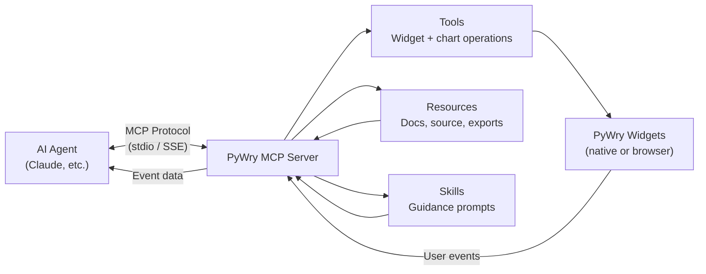

# MCP Server

PyWry includes a [Model Context Protocol](https://modelcontextprotocol.io/) server that lets AI agents — like Claude — create, manipulate, and destroy interactive widgets. The agent calls MCP tools to render charts, tables, forms, and dashboards, and receives user interactions back as events.

## Quick Start

```bash
# Install MCP support
pip install pywry[mcp]

# Run with stdio transport (default — for Claude Desktop)
python -m pywry.mcp

# Run with SSE transport (for web-based MCP clients)
python -m pywry.mcp --sse

# Headless mode (browser widgets instead of native windows)
pywry mcp --headless
```

## Claude Desktop Config

Add this to your Claude Desktop configuration file:

=== "Basic (native windows)"

    ```json
    {
      "mcpServers": {
        "pywry": {
          "command": "python",
          "args": ["-m", "pywry.mcp"]
        }
      }
    }
    ```

=== "Headless (browser widgets)"

    ```json
    {
      "mcpServers": {
        "pywry": {
          "command": "pywry",
          "args": ["mcp", "--headless"]
        }
      }
    }
    ```

=== "With virtual environment"

    ```json
    {
      "mcpServers": {
        "pywry": {
          "command": "/path/to/venv/bin/python",
          "args": ["-m", "pywry.mcp"]
        }
      }
    }
    ```

Then ask Claude:

> "Create a scatter plot showing monthly revenue vs. expenses"

Claude will use the MCP tools to build and display the chart.

## How It Works

The MCP server bridges AI agents and PyWry's rendering engine:


```mermaid
flowchart LR
    A["AI Agent<br>(Claude, etc.)"] <-->|"MCP Protocol<br>(stdio / SSE)"| B["PyWry MCP Server"]
    B --> C["Tools<br>Widget + chart operations"]
    B --> D["Resources<br>Docs, source, exports"]
    B --> E["Skills<br>Guidance prompts"]
    C --> F["PyWry Widgets<br>(native or browser)"]
    D --> B
    E --> B
    F -->|"User events"| B
    B -->|"Event data"| A
```

1. **Agent calls a tool** (e.g., `create_widget` with HTML + toolbar config)
2. **Server builds components** — converts JSON configs into Pydantic toolbar models, registers callbacks
3. **PyWry renders the widget** — native OS window or browser tab depending on mode
4. **User interacts** — clicks buttons, changes inputs, selects options
5. **Events queue up** — agent calls `get_events` to retrieve them
6. **Agent responds** — updates content, shows toasts, creates new widgets

## Two Rendering Modes

| Mode | Flag | How widgets appear | Best for |
|:---|:---|:---|:---|
| **Native** (default) | (none) | OS-native windows via PyTauri | Local development, desktop apps |
| **Headless** | `--headless` | Browser tabs via inline server | Remote servers, CI, Docker, SSH |

In headless mode, `list_widgets` returns URLs like `http://127.0.0.1:PORT/widget/{id}` that can be opened in any browser.

## AppArtifact — rich inline previews

In **headless** mode every widget-creating tool (`create_widget`,
`show_plotly`, `show_dataframe`, `show_tvchart`, `create_chat_widget`)
returns an `AppArtifact` alongside the usual JSON: a self-contained
HTML snapshot of the widget (CSS + JS + data inlined) carried as an
MCP [`EmbeddedResource`](https://modelcontextprotocol.io/docs/concepts/resources)
with `mimeType: text/html` and a `pywry-app://<widget_id>/<revision>`
URI. Clients that render HTML embedded resources show the app inline:

- **Claude Desktop** — renders in the artifact pane
- **mcp-ui-aware clients** — render in their UI surface
- **PyWry's own chat widget** — renders as a sandboxed iframe (see
  [AppArtifact reference](../reference/chat-manager.md#pywry.chat.artifacts.AppArtifact))

### Revision behaviour

Each render bumps a per-widget revision counter. Only the **latest**
revision keeps a live WebSocket bridge back to Python — the iframe
still fires events, runs callbacks, streams updates. **Older** revisions
in chat history freeze at their last known state: their WebSocket
reconnect is rejected with close code `4002 Older revision superseded`,
so the iframe shows what it last had.

To re-snapshot an existing widget after mutating it (e.g. after a
series of `send_event` or `tvchart_add_markers` calls), call
[`get_widget_app`](tools.md#get_widget_app) — it renders a fresh
`AppArtifact` with a bumped revision.

## Server Capabilities

The MCP server exposes three types of capabilities:

### Tools (39)

Operations the agent can call — creating widgets, updating content, managing state. Organized into eight groups:

| Group | Tools | Purpose |
|:---|:---|:---|
| **Discovery** | `get_skills` | Retrieve guidance and component reference |
| **Widget creation** | `create_widget`, `show_plotly`, `show_dataframe`, `show_tvchart`, `build_div`, `build_ticker_item` | Build new widgets (auto-return an [AppArtifact](#appartifact-rich-inline-previews) in headless mode) |
| **Widget manipulation** | `set_content`, `set_style`, `show_toast`, `update_theme`, `inject_css`, `remove_css`, `navigate`, `download`, `update_plotly`, `update_marquee`, `update_ticker_item`, `send_event` | Modify existing widgets |
| **Widget management** | `list_widgets`, `get_events`, `destroy_widget` | Track and clean up widgets |
| **Chat** | `create_chat_widget`, `chat_send_message`, `chat_stop_generation`, `chat_manage_thread`, `chat_register_command`, `chat_get_history`, `chat_update_settings`, `chat_set_typing` | Conversational chat widgets |
| **Resources & export** | `get_component_docs`, `get_component_source`, `export_widget`, `get_widget_app`, `list_resources` | Documentation, code generation, and rich HTML snapshots |
| **Autonomous building** | `plan_widget`, `build_app`, `export_project`, `scaffold_app` | LLM-powered end-to-end app creation |

### Resources

Read-only data the agent can access via `pywry://` URIs:

| URI | Content |
|:---|:---|
| `pywry://docs/events` | Built-in events reference |
| `pywry://docs/quickstart` | Getting started guide |
| `pywry://component/{name}` | Component documentation |
| `pywry://source/{name}` | Component Python source code |
| `pywry://source/components` | All component sources combined |
| `pywry://skill/{id}` | Skill guidance text |
| `pywry://export/{widget_id}` | Export active widget as Python code |

Rich HTML snapshots returned by widget-creating tools and `get_widget_app`
use a separate URI scheme served inline as `EmbeddedResource` content
rather than as fetchable resources:

| URI | Content |
|:---|:---|
| `pywry-app://{widget_id}/{revision}` | Self-contained HTML rendering of the widget at the given revision (`mimeType: text/html`) |

### Prompts (Skills)

Guidance prompts that teach the agent how to use PyWry effectively:

| Skill | What it teaches |
|:---|:---|
| `component_reference` | **Mandatory** — every component's properties, events, and JSON schema |
| `interactive_buttons` | Auto-wired `elementId:action` callback pattern |
| `native` | Desktop window mode, full-viewport layout |
| `jupyter` | Notebook integration — AnyWidget and IFrame approaches |
| `iframe` | Sandboxed embedding, postMessage communication |
| `deploy` | Production SSE server, horizontal scaling, Redis |
| `css_selectors` | Targeting elements for `set_content` / `set_style` |
| `styling` | CSS variables, theme switching, `inject_css` |
| `data_visualization` | Plotly charts, AG Grid tables, live data patterns |
| `forms_and_inputs` | Form building with validation and event collection |
| `modals` | Modal dialogs — schema, sizes, open/close/reset |
| `chat` | Conversational chat widget — streaming, threads, slash commands, providers |
| `chat_agent` | Operating inside a running chat widget — `@<name>` attachments, tool-call cards, reply style |
| `authentication` | OAuth2 / OIDC sign-in (Google, GitHub, Microsoft, custom) and RBAC wiring |
| `tvchart` | Driving a TradingView chart — symbols, intervals, indicators, markers, compares, layouts |
| `events` | PyWry event bus — namespaced `ns:name`, widget routing, request/response correlation |
| `autonomous_building` | End-to-end app generation with `plan_widget`, `build_app`, `export_project`, `scaffold_app` |

## Next Steps

- **[Setup](setup.md)** — Installation, CLI options, client configuration
- **[Tools Reference](tools.md)** — Every tool with parameters and examples
- **[Skills & Resources](skills.md)** — How the agent learns PyWry
- **[Examples](examples.md)** — Common workflows and patterns
